# User Manual - Forcebit Wireless Measurement

## Table of Contents
- [User Manual - Forcebit Wireless Measurement](#user-manual---forcebit-wireless-measurement)
  - [Table of Contents](#table-of-contents)
  - [General info](#general-info)
  - [Product info](#product-info)
    - [Dot](#dot)
    - [Accbit](#accbit)
    - [Telbit](#telbit)
  - [Requirements](#requirements)
  - [Installation](#installation)
  - [1. How to run a measurement with GUI](#1-how-to-run-a-measurement-with-gui)
    - [1.1 Measurement](#11-measurement)
    - [1.2 Calibration](#12-calibration)
    - [1.3 Nulling](#13-nulling)
  - [2. How to run a measurement with BAT files](#2-how-to-run-a-measurement-with-bat-files)
    - [2.1 Measurement](#21-measurement)
    - [2.2 Calibration](#22-calibration)
  - [3. How to integrate Python script into your application](#3-how-to-integrate-python-script-into-your-application)
    - [3.1 Using Python Scripting with Pycharm](#31-using-python-scripting-with-pycharm)
    - [3.2 Using Command Prompt](#32-using-command-prompt)
  - [4. How to integrate Matlab script into your application](#4-how-to-integrate-matlab-script-into-your-application)

## General info

This is the user manual for performing wireless measurements using Forcebit products.
This manual is tailored for installation and usage of the software on Windows operating system (Win10 or higher).
In order to use the software, you need at least one Forcebit gateway and one or more Forcebit sensors (Dot, Accbit or Telbit).
Make sure your laptop is not in power save mode, as it may cause connection issues or problems with displaying.
We recommend using a laptop with at least 8GB RAM and a dual-core processor, ensuring it's connected to a power source during measurements.

You can power the gateway by plugging it into a power adapter or a powerbank for mobile applications, see the figure below.
The power source should be providing 5V, and at least 15 Watts and 3A current.
The power sources below these requirements might work, but it is not guaranteed.
The gateway also has a unique ID, which is written on the gateway box. 
The gateway is the server of the system and it connects to the computer via Wi-Fi or Ethernet. 
Note that the user must connect to the gateway at least once via Wi-Fi to set up the Ethernet connection correctly.
Afterwards, the user can connect to the gateway via Ethernet cable. 

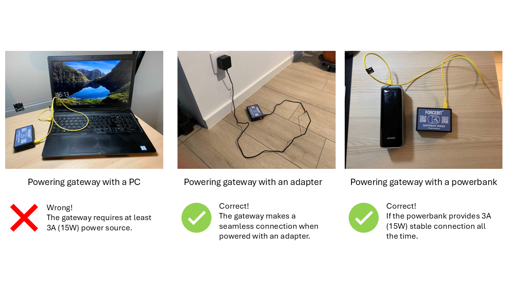

A gateway has 2 modes:

1. connected mode: the gateway is connected and ready to receive commands.
2. sampling mode: the gateway is receiving data from the connected sensors and sending them to the computer.

Each sensor has a unique ID, which is written on the sensor box and also on the sensor itself.
A sensor has 3 modes: 

1. standby mode: the sensor is only advertising its presence to the nearby gateways. 
2. connected mode: the sensor is connected to a gateway and ready to receive commands.
3. sampling mode: the sensor is sampling the selected signals and sending them to the gateway.

**Important Note:** Sensors consume ~20x more power in connected mode than in standby mode.
Always disconnect sensors when not in use.

The sampling frequency and the number of channels depend on the sensor type:

* A Dot sensor has 3 channels (Ax, Ay, Az) and can sample up to 16 kHz per channel.
* An Accbit sensor has 4 channels (C1, C2, C3, C4), outputs 3 signals (angle, velocity and acceleration) and can sample up to 8 kHz per channel.
* A Telbit sensor has 5 channels (V1, V2, V3, V4, V5) and can sample up to 4 kHz per channel with ADC signals, and up to 8 kHz per channel without ADC signals.

| Sensor  | Max Sampling Frequency |
|---------|-------------------------|
| Dot     | &lt;= 16 kHz |
| Accbit  | &lt;= 8 kHz |
| Telbit  | &lt;= 4 kHz (ADC), &lt;= 8 kHz (non-ADC) |
| Aggregate | &lt;= 48 kHz |

A gateway can connect up to 6 sensors at the same time.
It has a limit of aggregated sampling frequency of 48 kHz.
Aggregated sampling frequency is the sum of the sampling rates of the channels of connected sensors.
If a Dot is sampling at 16 kHz with 3 channels (Ax, Ay, Az), it consumes 16 x 3 = 48 kHz from the aggregated sampling frequency.
If you sample an Accbit at 4 kHz and a Dot at 4 kHz with all channels, the aggregate sampling rate is 4 x 3 + 4 x 4 = 28 kHz.

## Product info

### Dot

The Dot is a small, wireless, triaxial accelerometer for measuring linear vibrations and shocks machinery.
You can find more information and technical specifications of the Dot sensor on [https://forcebit.eu/products/dot/](https://forcebit.eu/products/dot/).

### Accbit

The Accbit is a wireless, multi-axial encoder for measuring shaft angle, angular velocity and angular acceleration.
You can find more information and technical specifications of the Accbit sensor on [https://forcebit.eu/products/accbit/](https://forcebit.eu/products/accbit/).

### Telbit

The Telbit is a wireless, multi-axial telemetry system for measuring shaft angle, angular velocity, angular acceleration, strain and temperature.
You can find more information and technical specifications of the Telbit sensor on [https://forcebit.eu/products/telbit/](https://forcebit.eu/products/telbit/).

<!-- ## Disclaimer

This software is developed to perform wireless measurements with Forcebit sensors.
It is tested on Windows 10 and 11 operating systems.
The software is provided for free of charge for Forcebit customers.
 -->

## Requirements

* Operating system: Windows10 or higher.
* Memory: 1GB free space at your hard drive.
* Processor: Minimum 2 core CPU with 2.0GHz or higher
* RAM: 4GB or higher

## Installation

* Please unzip `ForcebitSW.zip` to your PC, preferably with 7Zip [download here](https://www.7-zip.org/download.html). The directory that you extract `ForcebitSW.zip` file is the [installation_path], e.g. `C:\ForcebitSW`.
* Save the sensor and gateway files to `[installation_path]\SensorAndGatewayFiles`.
* That's all! You are set to go.

## 1. How to run a measurement with GUI

* Turn on your gateway by plugging it into a power source.
* Check out the number written on your gateway, e.g. `GATEWAY 100007`. Then, 7 is the ID of your gateway.
* Connect to `forcebit[ID]-gw` Wi-Fi, in this case `forcebit7-gw`.
* Go to the directory that `ForcebitSW` is installed.
* Double-click on the `.\MainGUI.bat` and the GUI starts.

* First, the Main Menu will appear. In the main menu, you have 2 options:
  1. Measurement: Select Measurement if your sensors are already calibrated after mounting to the shaft or you want to perform linear acceleration measurements. Nulling of the load sensors can be done in the Measurement Window.
  2. Calibration: Select Calibration if you want to calibrate your Accbit, Telbit or Forcebit after mounting to a shaft.

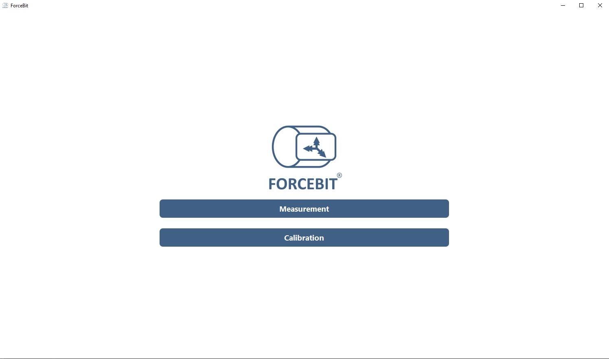

A command prompt window also pops up to give more information in the process and for troubleshooting.

### 1.1 Measurement

1. The GUI starts from the `Connect` tab, where you can connect to the gateway and sensors. If you have only one gateway, the GUI automatically connects to it. For multiple gateways, you can browse the gateway files by pressing the `Drop Gateway File Here` button and selecting the desired file. Alternatively, you can locate the gateway file in `[installation_path]\SensorAndGatewayFiles` and drop it into the designated area. If the gateway connection fails, ensure that your Wi-Fi is connected to `forcebit-gw`. A successful gateway connection is indicated by the `Gateway connected` message in the status bar.

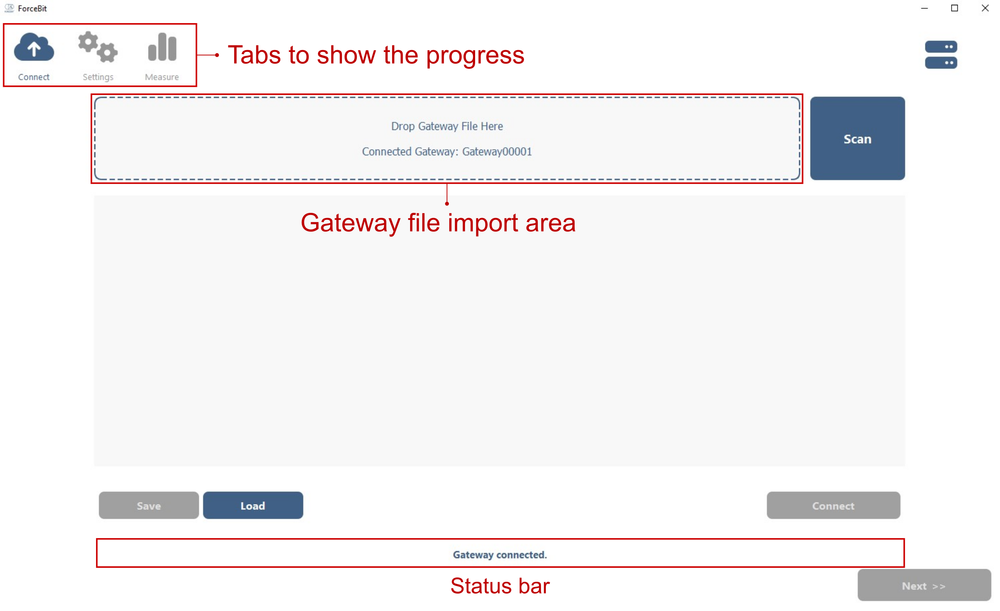

2. After the connection is successful, `Scan` button is enabled. Then, you press the `Scan` button to list the Forcebit sensors in the vicinity (&lt; 20m) which are not connected to a gateway. Please make sure the sensor has enough power by plugging it, if you cannot see a sensor in the list.  

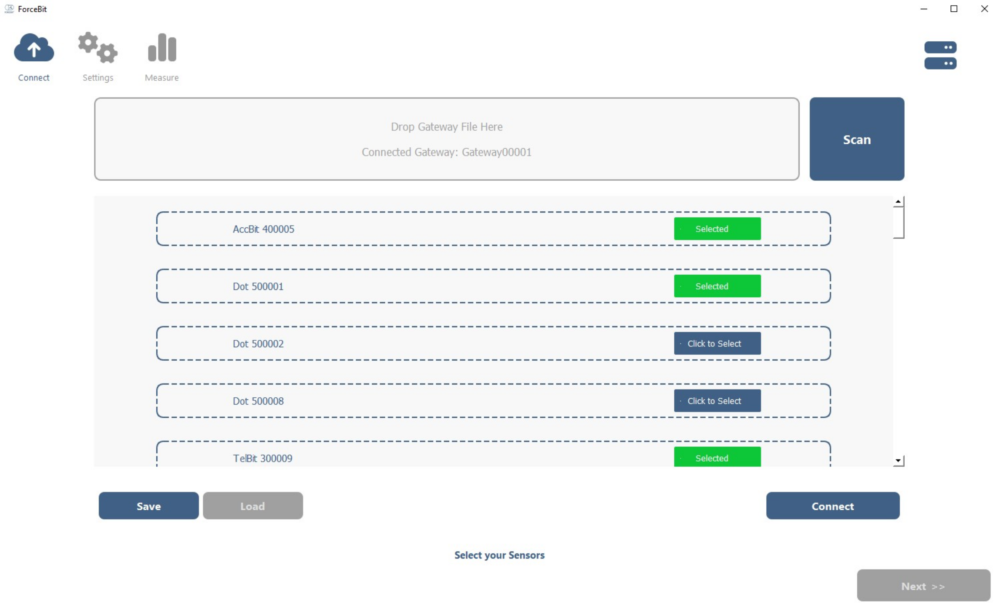

3. Please select the sensor you want to measure with and Press `Connect` button. This may take a while if you select more than 4 sensors at once **(max. 6 sensors)**. When all sensors connected, status bar notifies you with `Connected` message. You can also see the connected sensors at the top right.

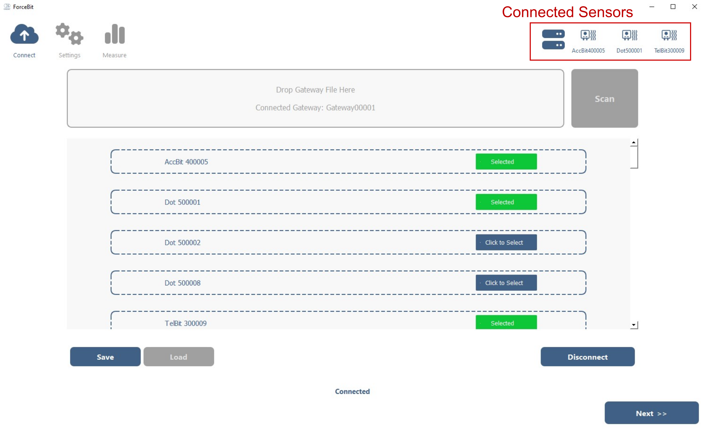

4. After the connection, the `Connect` button is replaced with `Disconnect` button. You can disconnect the sensors by pressing the `Disconnect` button. If you want to reconnect, you can select the sensors again and press `Connect` button. 


5. If you plan to use the sensor and gateway configuration later on, you can save the configuration by specifying the name and pressing the `Save` button. To a load a saved configuration, you can press the `Load` button and select the configuration. This will automatically select the gateway and sensors and connects to them.

6. After you are connected to the gateway and sensors, you can press the `Next` button to proceed to the `Settings` tab. 

7. In the settings tab, you can configure the measurement settings for each sensor. 
Each sensor has a dedicated box. You can select frequency, acceleration range and signal power for each sensor.
You can select signals to be sampled by checking the checkboxes of the desired signals.
Moreover, you can also set the folder where the measurement results are saved on the bottom left.

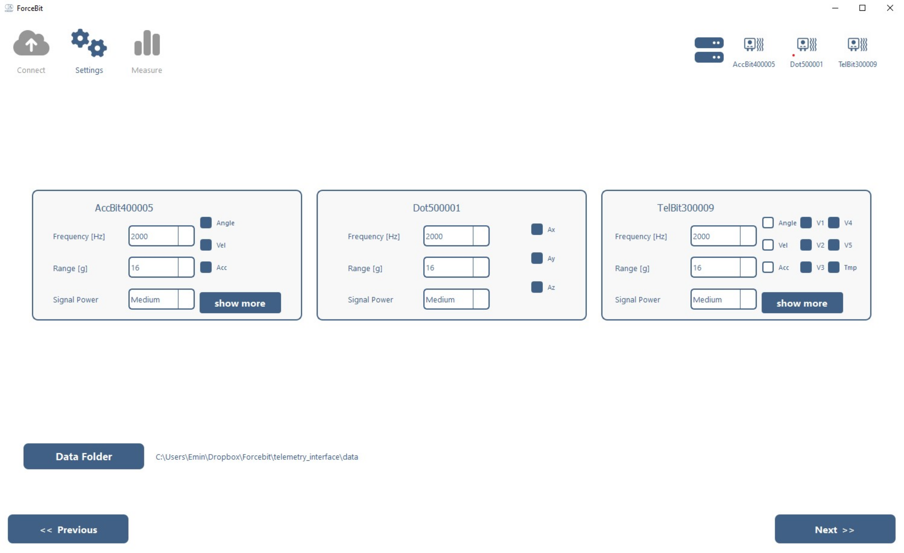

8. For Accbit and Telbit, if you want to measure the acceleration directly from the sensor, you can press the `show more` button to check the acceleration signals. ADC signals can be filtered with a low-pass 4th order Butterworth filter for Telbit. You can set the cut-off frequency in Hz from the dialog that pops-up with `show more` button.

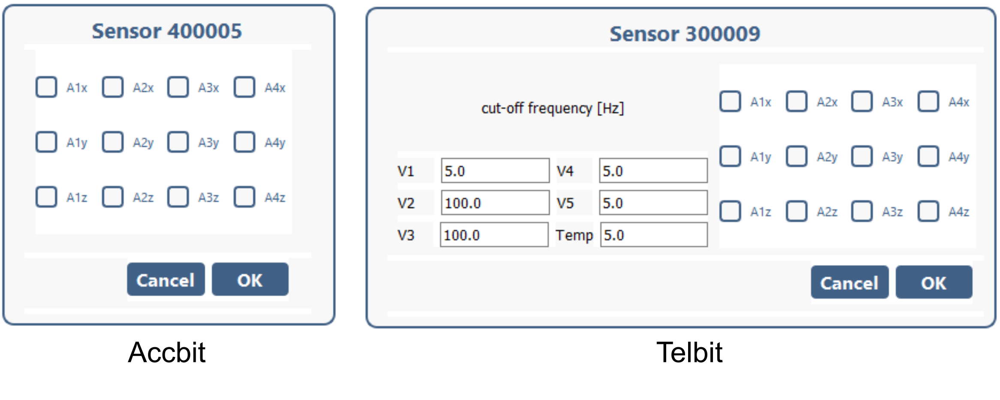
 
9. After setting the measurement settings, you can proceed to the `Measure` tab by pressing the `Next` button. GUI will set the sensor settings while proceeding to the `Measure` tab. This may take a while if you have many sensors connected.

10. In the `Measure` tab, you can set the measurement duration at the bottom left and name the measurement run on the top right to access the results in the data folder. 
If you want to display specific signals on the plots, you can select the desired signals on the left panel of each plot.

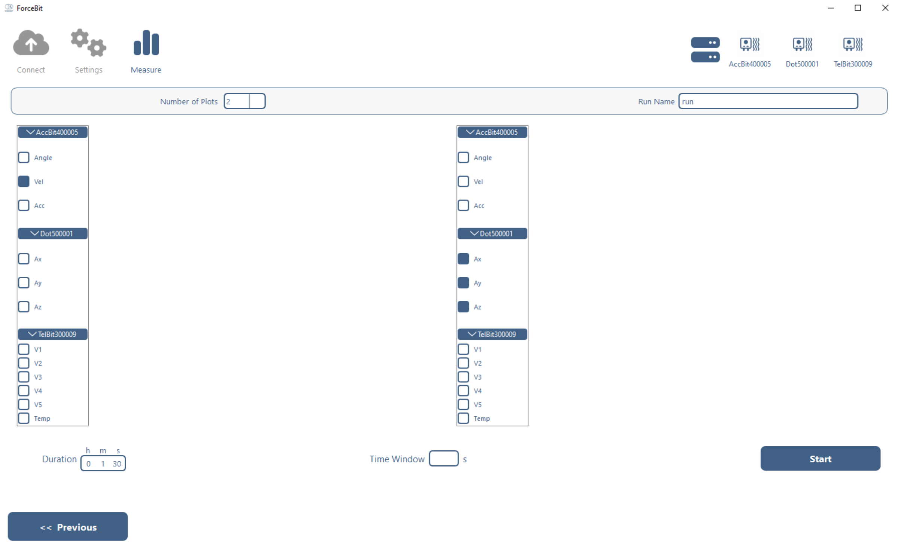

11. After you are set (or you are OK with default values), you can start the measurement by pressing the `Start` button.
After pressing the `Start` button, the gateway and sensor icons turn to <span style="color:green">green</span> and `Start` button turns to `Stop` button.
The live plots will be shown during the measurement if you selected any signals to display.
You can prematurely stop the measurement by pressing the `Stop` button.
Otherwise, the measurement stops automatically after the specified duration. 

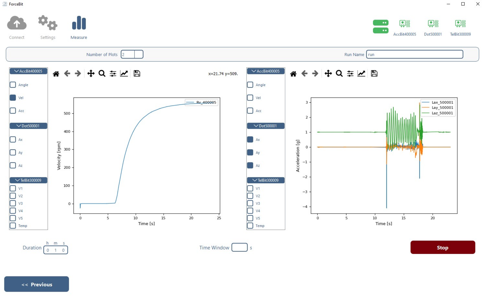

12. When the measurement is completed, the software performs clock synchronization if more than one sensor is used.
This may take several seconds depending on the number of sensors used and the measurement duration.
After the synchronization, the measurement results (`.csv` files) and the plots are updated.
The sensor and gateway icons turn to <span style="color:blue">blue</span> showing that they are connected and ready for another measurement, and `Stop` button turns to `Start` button.
You can start another measurement by pressing the `Start` button again.

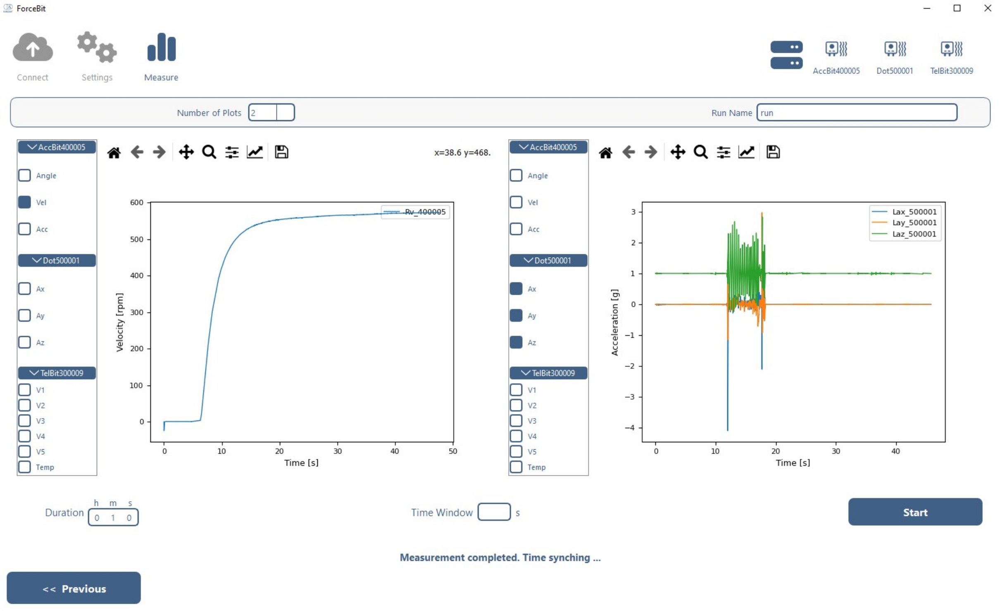

13. If you want to change the measurement settings, you can go back to the `Settings` tab by pressing the `Previous` button. If you want to change the connected sensors, you can go back to the `Connect` tab by pressing the `Previous` button twice.

14. If you are done with your measurements, you can close the Measurement Window with pressing the `X` button on the top right. Then it will ask you 3 options, 1. Go to Main Menu, 2. Exit and 3. Cancel. If you want to exit the software, you can press the `Exit` button. This will disconnect the sensors and gateway and close the software. If you want to do a calibration, you can press the `Go to Main Menu` button. This will disconnect the sensors and gateway and bring you to the main menu.

### 1.2 Calibration

The calibration is required after mounting the Accbit or Telbit to a shaft.
The steps for calibration are similar to the measurement until the `Measure` Tab (steps 1-10). The differences are explained below:

* You can select only one Accbit or Telbit for calibration at a time.
* In the `Settings` tab, you can only set frequency, acceleration range and signal power. The signals to be measured are fixed for calibration.
* It is advised to set the frequency and acceleration range as high as possible (8kHz and 16g) for better calibration results.

1. In the `Calibrate` tab, you can set the calibration duration at the bottom left.
Longer calibration durations generally produce more accurate results.
However, the calibration duration should be at least 3-5 min for a good calibration.
You can name the calibration run on the top right to access the results in the data folder.

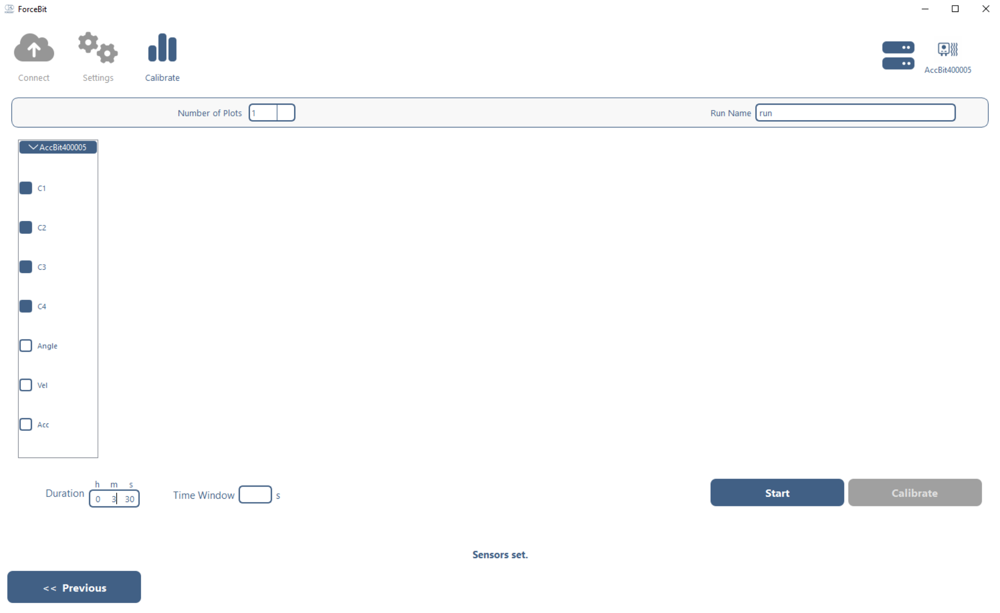

2. When you are ready, you can start the calibration by pressing the `Start` button.
After pressing the `Start` button, the gateway and sensor icons turn to <span style="color:green">green</span> and `Start` button turns to `Stop` button.
The live plots will be shown during the calibration with the calibration variables (accelerations). 
It is important to rotate the shaft in the speed range that you want to measure.
The best calibration procedure is to increase the speed step by step until the maximum speed and then decrease it step by step to median.
During the calibration, it is important to dwell (10-20s) at each speed step to capture the accelerations at constant speeds.

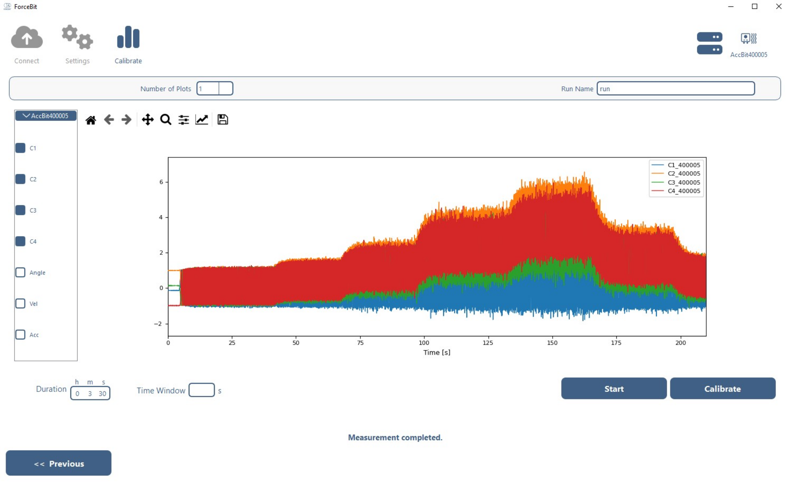

3. After the calibration measurement is completed, you can press the `Calibrate` button to perform the calibration.
This may take several seconds depending on the measurement duration.
After the calibration, the measurement results (in `Peripheral[nr]_[date/time].csv` files) and the calibration results (in `calibrationPeripheral[nr]_[date/time].csv` files) in the selected data folder.
You can see the calibration results in the plots by selecting the desired signals on the signal selection panel on the left.
Now, you can use the calibrated sensor for measurements.

### 1.3 Nulling 

Our load sensors (Telbit and Forcebit) can be nulled to remove any offset in the strain and temperature measurements.
Along with the nulling, the user can also determine the sensitivity of the sensor by changing the gains of strain and temperature channels.
The steps for nulling are similar to the measurement until the `Measure` Tab (steps 1-11). 
Nulling is done at the Measurement Window in `Measure` tab.
The differences are explained below:

* You can select only one Telbit or Forcebit for nulling at a time.

1. When there is only one Telbit or Forcebit connected, the `Nulling` button is enabled.

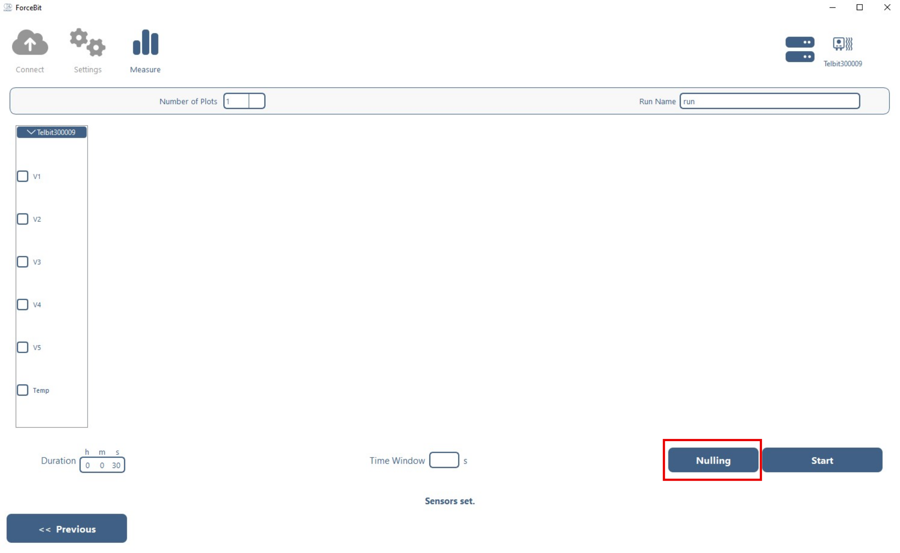

2. When the Nulling button is pressed, a dialog pops up. In the dialog, you can see the current DAC values and gains of strain and temperature channels. DAC values are the offsets that are subtracted from the raw measurements on the hardware side. The gains are the multipliers for the raw measurements that defines the sensitivity of a channel. The offsets are added to the signals after multiplying with the gains. You cannot see the current values of the offsets because they are incrementally modified.

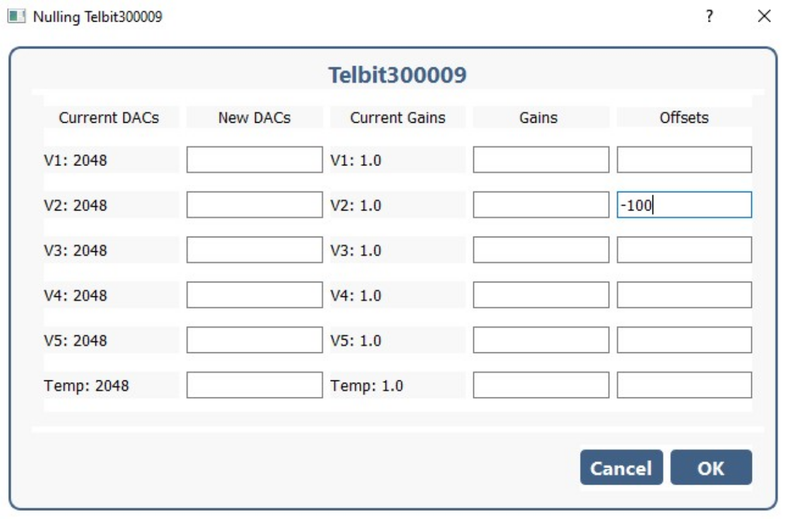

3. You can do the nulling by selecting the values and pressing `OK` button in the SetDAC dialog during and in-between measurements. You can see that the nulling is successful by checking the live plots and seeing the `New DACs set.` message on the status label or `DAC_values_set.` message on the console.

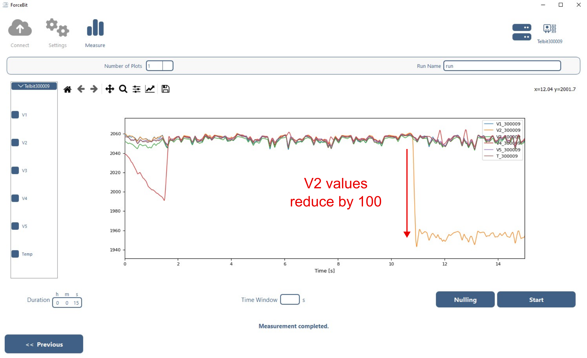

* It is advised to set the offsets and the gains first. If the measurement values are still out of range, you can set the DAC values for the associated signal(s).
* It is advised to choose a suitable time window, for example 5s, to see the effect of the changes in the plots if you do a live nulling.

## 2. How to run a measurement with BAT files 

### 2.1 Measurement 
Using the BAT file is a quick way to perform a measurement without using the GUI.

1. Turn on your gateway by plugging it into a power source.
2. Check out the number written on your gateway, e.g. `GATEWAY 100007`. Then, 7 is the ID of your gateway.
3. Connect to `forcebit[ID]-gw` Wi-Fi, in this case `forcebit7-gw`.
4. Go to the directory that `ForcebitSW` is installed.
5. Select the gateway that you will host and the sensors that you use for measurement in `gateway_and_sensor_selection.txt`. The user can find the sensor and gateway file in `[installation_path]\SensorAndGatewayFiles`. **Select maximum 6 sensors.** Just select the file names (without the extension) like in the example below:

```
Gateway00001
Dot500001
Accbit400005 
Telbit300009 
Dot500002 001
```

* `Gateway00001` represents the server to be selected. 
* `Dot500001` selects the Dot sensor with sensor number 500001. 
* `Accbit400005` selects the Accbit sensor with sensor number 400005.
* `Telbit300009` selects the Telbit sensor with sensor number 300009.
* `Dot500002 001` line selects the dot sensor with sensor number 500015 but only measures acceleration in z-direction (Az).
If no number is indicated the signals will be selected as default.

Here is the syntax for signal selection for each sensor:

**Dot**

* Selection: A1x, A1y, A1z
* Default: A1x, A1y, A1z

Examples:

* `Dot500002` : means Ax, Ay, Az are measured by default.
* `Dot500002 001` : means only Az is measured.
* `Dot500002 101` : means Ax and Az are measured.

**Accbit**

* Selection: A1x, A1y, A1z, A2x, A2y, A2z, A3x, A3y, A3z, A4x, A4y, A4z; e.g. `100100100100` measure the tangential acceleration `Ax` for all sensors along with angle, rotational velocity, rotational acceleration.
* Default: angle, velocity, acceleration

Examples:

* `Accbit400005` : means angle, velocity, acceleration are measured by default.
* `Accbit400005 001001001001` : means all tangential signals are measured along with angle, velocity, acceleration.
* `Accbit400005 000 100100100100` : means Ax for all 4 sensors are measured but no angle, velocity, acceleration.

**Telbit**

* Selection: V1, V2, V3, V4, V5, Temp; e.g. `111111` measures all stress and temperature ADC (Analog-Digital converter) signals. angle, velocity, acceleration; e.g. `111`, and accelerations A1x, A1y, A1z, A2x, A2y, A2z, A3x, A3y, A3z, A4x, A4y, A4z; e.g. `100100100100` measure the tangential acceleration `Ax` for all accelerometers. 
* Default: V1, V2, V3, V4, V5, Temp, angle, velocity, acceleration.

Examples:

* `Telbit300009` : means V1, V2, V3, V4, V5, Temp, angle, velocity and acceleration are measured by default.
* `Telbit300009 111111` : means only ADC signals V1, V2, V3, V4, V5, Temp are measured.
* `Telbit300009 111 1111111` : is the same with default settings, it measures all ADC signals, angle, velocity and acceleration.
* `Telbit300009 000 100100100100` : means Ax for all 4 accelerometers are measured but no ADC signals, angle, velocity, acceleration.
* `Telbit300009 011000 001001001001` : means V2, V3 and Ax for all 4 accelerometers are measured but no angle, velocity, acceleration.
* `Telbit300009 111` : means that Telbit is used as an Accbit and only angle, velocity and acceleration are measured.

It is also possible to comment out some of the sensors during the sensor selection by adding `#` symbol at the beginning of the line. In the example below, the Dot500014 will not be used in the measurement.

```
Gateway00001
# Dot500014
Dot500015 001
```

Before running the measurement, you can set the filter values for a telbit sensor in `\temp\filters_[peripheral number].txt` file.
Also it is possible to set DAC values in `\temp\DAC_values_[peripheral number].txt` file for load sensors (Telbit and Forcebit) before the measurement.

1. Set the measurement settings by editing `measurement_settings.txt`. The measurement settings are: 
  * **frequency:** the frequency of the sampling of the selected sensors as an `int`.
  * **ARange:** the measurement range of the accelerometer in g as an `int`. ARange value can be selected from a discrete set [2, 4, 8, 16]. You must set acceleration range based on the expected acceleration levels. If the acceleration range is set too low, the sensor may saturate and the measurement will be invalid. If the acceleration range is set too high, the resolution of the measurement decreases. 
  * **txPower:** the signal strength of the peripheral in dB as an `int` type. txPower value can be selected from [-20, -16, -12, -8, -4, 0, 4, 8]. Higher values mean higher signal strength, but also higher power consumption.
  * **measurementTime:** the measurement duration per loop in s as an `int`.
  * **loops:** the number of loops to be performed as an `int`. Total measurement time = measurementTime x loops.
  * **saveDataFolder:** the name of the folder (as `string`) where measurement results are saved `.\data\[saveDataFolder]` in `.csv` format.

2. Double-click on `clickRun.bat`. A command prompt will pop-up. The program will connect to the gateway, the gateway will scan the sensors in vicinity and connect the selected sensors if they are in range and charged.

**Note:** For long measurements, it is advised to run without live plotting to avoid any display issues during the measurement. You can do this by double-clicking `clickRunNOPLOT.bat`. 
You can also split your measurement into several pieces by setting the number of loops and measurement time per loop in `measurement_settings.txt`.


3. When the user is ready, please press any key to start the measurement on the main command prompt. By pressing the button, the measurement will start and a live plot will pop up for each sensor.

### 2.2 Calibration

The calibration is done in a similar fashion with measurement with BAT file. 

* You can set the calibration time with `measurementTime` in `measurement_settings.txt`. It is advised to set the calibration time at least 3-5 min for a good calibration.
* The rest of the settings are by default:
  * **frequency:** 8000 Hz
  * **ARange:** 16 g
  * **txPower:** 0 dB

* You can select only one Accbit or Telbit for calibration at a time in `gateway_and_sensor_selection.txt`.
* The signals to be measured are fixed for calibration. You cannot change them in `gateway_and_sensor_selection.txt`. Therefore, just write the sensor file name without any signal selection.

Example:
```
Gateway00001
Accbit400001 
```

* After measurement settings and sensor selection is done, please double-click on `clickCalibrate.bat`. A command prompt will pop-up. The program will connect to the gateway, the gateway will scan for the selected sensor and connect to it if it is in range and charged.
* When the user is ready, please press any key to start the calibration on the command prompt. By pressing the button, the calibration measurement will start and a live plot will pop up for the sensor.
* After the calibration measurement is completed, calibration procedure starts automatically. And at the end of the calibration, the states (angle, velocity and acceleration) will be displayed in the plot.

## 3. How to integrate Python script into your application

The essential functionalities of the measurement software can be found in `Measurement.py`. 
It is a good template, therefore, please take a copy of the original `Measurement.py` file or modify it at your own risk. 
After creating a copy, `Measurement.py` is at your disposal to understand and debug the code and its functionalities.

### 3.1 Using Python Scripting with Pycharm 

* open the folder that contains the project e.g. `C:\ForcebitSW`.
* go to the lower right corner and press `interpreter settings`, 
* go to: python interpreter -> add interpreter -> add local interpreter,
* go to the tab 'system interpreter' and select the python.exe in the folder e.g. `C:\ForcebitSW\ForcebitSW\PyForcebit\python.exe`,
* then all the necessary libraries should be recognized and you are good to go.

Pycharm is a convenient IDE for many python users.
What you need to do to run or debug your python application using PyForcebit measurement functions and modules is listed as follows:

1. Download and install Pycharm community edition to your computer from clicking this [link](https://www.jetbrains.com/pycharm/download/?section=windows), if you don't have one. (optional)
2. Open the `ForcebitSW` folder at your `installation_path`.
3. Set the Python interpreter to `.\PyForcebit\python.exe`.
   1. See the general view below, you can have two options: 1. setting manually, 2. Pycharms automatically sets PyForcebit for you.

   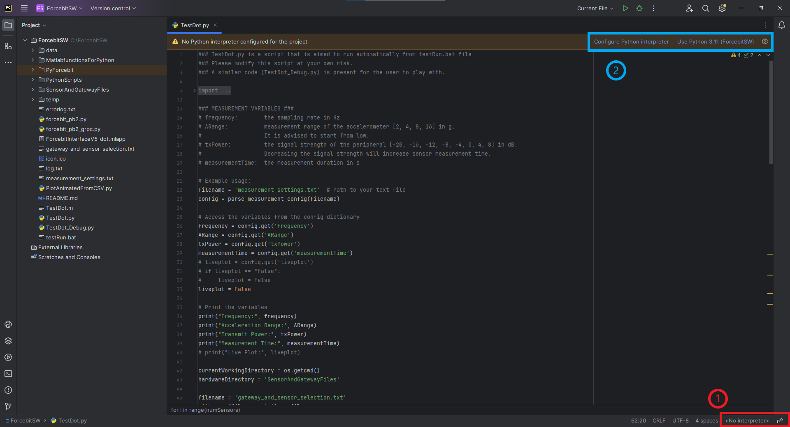
   2. If you go with manual selection press, "No Interpreter" tab. Then, this tab will open:

   
   3. Select Add New Interpreter > Add local Interpreter.
   4. A window pops up below:

   
   5. Select "System Interpreter" and browse to the `.\PyForcebit\python.exe`.
4. Run or debug the python code using the button's shown below. It is possible to set a breakpoint at any line and watch the local variables in the code.

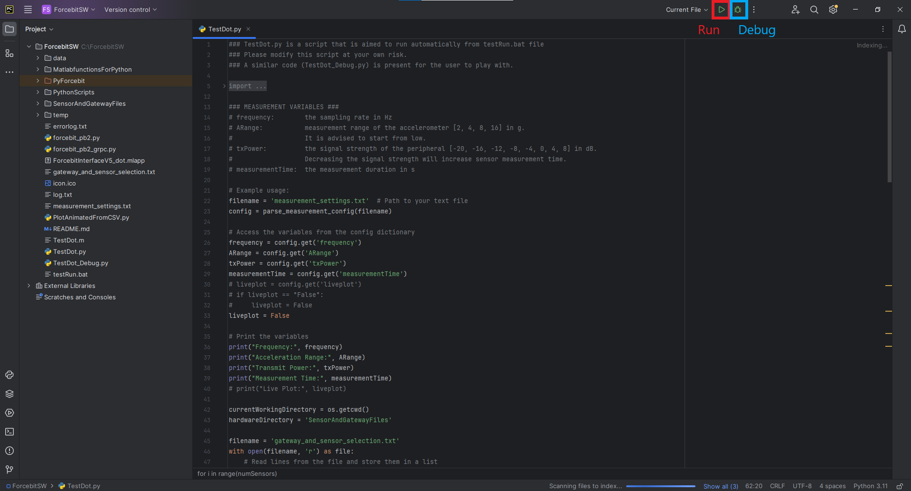

### 3.2 Using Command Prompt

Perform steps 1–3 from the [GUI section](#1-how-to-run-a-measurement-with-gui) to turn on the gateway and connect to its Wi-Fi.

1. Open the command prompt by pressing the `Win` key and type `Command Prompt`.
2. Go to installation folder by using `cd [installation folder]`
3. Activate the dedicated python by `.\PyForcebit\Scripts\activate.bat`.
4. Run your python code on the command prompt, e.g. `python Measurement.py`.
You can also debug your code in command prompt using the debug module in python, e.g. `python -m pdb Measurement.py`.
Check the official Python website to learn how to use pdb for debugging [here](https://docs.python.org/3/library/pdb.html).
5. Deactivate the python by `deactivate`.

## 4. How to integrate Matlab script into your application

The utilities functions are stored in the `MatlabfunctionsForPython` folder in the same directory.
Here you can find all the necessary functions to perform a measurement or a calibration.
`Measurement.m` serves as a reference on how to integrate the Matlab functions into your scripts.
It covers all the steps described in Measurement with GUI above:

* Selecting the gateway and connecting to it,
* Creating sensor instances,
* Scanning for the sensors,
* Connecting the selected sensors if they were in scanned sensors,
* Setting the measurement settings and signals to measure for different type of sensors,
* Performing the measurement for a predefined time,
* Reading the measurement results and live plotting,
* Disconnecting sensors,
* Postprocessing after the run (e.g. clock synchronization),
* Disconnecting the gateway.

Similarly, `Calibrate.m` shows how to calibrate an Accbit or Telbit.

Note that your Matlab script uses `PyForcebit` Python interface to call the functions in `MatlabfunctionsForPython` folder.
If you used another python environment for a different purpose before Forcebit scripting, you have to restart Matlab to use the PyForcebit python environment.
You can check which python environment is used by Matlab by `pyenv` command and it has to point to `PyForcebit` in order to use Matlab scripting.
You can find more information about Matlab-Python integration [here](https://www.mathworks.com/help/matlab/matlab_external/install-supported-python-versions.html).

<!-- ```matlab
clear all, %close all; clc;

tic

% we add the appropriate path
addpath('MatlabfunctionsForPython')

currentWorkingDirectory = pwd;
Gateway00001 = fullfile(currentWorkingDirectory, 'SensorAndGatewayFiles', 'Gateway00001.txt');
mysensor1 = fullfile(currentWorkingDirectory, 'SensorAndGatewayFiles', 'Telbit300010.txt');
mysensor2 = fullfile(currentWorkingDirectory, 'SensorAndGatewayFiles', 'Dot500010.txt');
mysensor3 = fullfile(currentWorkingDirectory, 'SensorAndGatewayFiles', 'Accbit400005.txt');

sensors = {
mysensor1,
mysensor2,
mysensor3,
};
numSensors = size(sensors,1);
sensorNrList = [];

utils = includePythonLibraries();

% read gateway & sensor
[myrun, success, message] = ReadGateway(utils, Gateway00001, false, false);
if ~success
    error(message);
end
for i=1:numSensors
    [Peripheral, myrun, success, Nr, message]   = CreatesAsensorInstance(utils, myrun,sensors{i});
    sensorNrList = [sensorNrList; Nr];
end

 % readCPUtemperatureGateway(myrun)

% set the location where to drop your fies
path = fullfile(currentWorkingDirectory, 'data');
folder = 'here'; 

% scan to get all your peripherals
[Peripheral, myrun, success] =  Scan(utils, myrun);

% process only when all peripherals are found in the scanning process
if ~areallPeripheralsScanned(utils, myrun)
    error('Not all peripherals are scanned. Execution stopped.');
end

% we connect to the peripheral
[Peripheral, myrun, success] = Connect(utils, myrun);

for i=1:numSensors
    Nr =  sensorNrList(i);
    if Nr >= 500000 && Nr < 600000 % dot
        Peripheral(i).A1x = 1;
        Peripheral(i).A1y = 1;
        Peripheral(i).A1z = 1;
        Peripheral(i).samplerate = 2000; %Hz
        Peripheral(i).Arange = 16; % 4-16g range
        Peripheral(i).txPower = 0; % 0dB default
    elseif Nr >= 400000 && Nr < 500000 % accbit
        % Peripheral(i).A1x = 1;
        Peripheral(i).combo=1;
        Peripheral(i).samplerate = 2000; % Hz
        Peripheral(i).Arange = 16; % 4-16g range
        Peripheral(i).txPower = 0; % 0dB default
    elseif Nr >= 300000 && Nr < 400000 % telbit
        DACfilename = sprintf('./temp/DAC_values_%d.txt', Nr);
        if exist(DACfilename, 'file')
            DAC_values = readmatrix(DACfilename);  % or use load() if it's pure numeric
            Peripheral(i).DAC1 = DAC_values(1);
            Peripheral(i).DAC2 = DAC_values(2);
            Peripheral(i).DAC3 = DAC_values(3);
            Peripheral(i).DAC4 = DAC_values(4);
            Peripheral(i).DAC5 = DAC_values(5);
            Peripheral(i).DAC6 = DAC_values(6);
        else
            % default DAC values
            Peripheral(i).DAC1 = round(2048 * 1.0);
            Peripheral(i).DAC2 = round(2048 * 1.0);
            Peripheral(i).DAC3 = round(2048 * 1.0);
            Peripheral(i).DAC4 = round(2048 * 1.0);
            Peripheral(i).DAC5 = round(2048 * 1.0);
            Peripheral(i).DAC6 = round(2048 * 1.0);
        end
        % set DAC values
        setDAC(myrun,Peripheral(i));
        % filters
        channels = {'V1', 'V2', 'V3', 'V4', 'V5', 'T'}; % channels to be filtered
        cutoff = [5, 100, 100, 5, 5, 5]; % Hz
        setFilter(myrun, Nr, channels, cutoff); 
        % selecting signals to sample
        Peripheral(i).combo = 1; % means angular acceleration, velocity and angle
        Peripheral(i).V1 = 1;
        Peripheral(i).V2 = 1;
        Peripheral(i).V3 = 1;
        Peripheral(i).V4 = 1;
        Peripheral(i).V5 = 1;
        Peripheral(i).Temp = 1;
        % Peripheral(i).A1x = 1;
        % Peripheral(i).A2x = 1;
        % Peripheral(i).A3x = 1;
        % Peripheral(i).A4x = 1;
        % measurement settings
        Peripheral(i).samplerate = 2000; % Hz
        Peripheral(i).Arange = 16; % 4-16g range
        Peripheral(i).txPower = 0; % 0dB default
    else
        error(sprintf('Sensor %d is not recognized', Nr));
    end
end
[Peripheral, succes] = setSensor(utils, myrun, Peripheral);
 
% start the measurement
measurementTime = 30; % in s
refresh = 1;

disp('starting the measurement')
[Peripheral, myrun, foldername] = SetFastRun(utils, myrun, measurementTime,Peripheral, path, folder); 

% plot the data
screenSize = get(0, 'ScreenSize');
screenSize_x = screenSize(3);
screenSize_y = screenSize(4);
margin_x = 50;
margin_y = 50;
plotsize_x = 600;
plotsize_y = 600;
numScreens = 0;

figures = gobjects(1, numSensors);
next_x = margin_x;
next_y = margin_y;
for i = 1:numSensors
    figures(i) = figure('Position',[next_x, next_y, plotsize_x, plotsize_y]); % Create a new figure and store its handle
    next_x = next_x + plotsize_x;
    if (next_x > screenSize_x)
        next_x = margin_x;
        next_y = next_y + plotsize_y;
        if next_y > screenSize_y
            % screen is full - create a new screen
            next_y = margin_y;
            numScreens = numScreens + 1;
            next_x = next_x + numScreens * margin_x;
            next_y = next_y + numScreens * margin_y;
        end
    end
end

done = 0;
run=[];
while ~done

    % read CSV and extract measurement data
    [run, slowtable, done] = readMeasurementFolder(foldername, run);

    for i=1:numSensors
        figure(figures(i));
        Nr =  sensorNrList(i);
        if(run(i).length > 0)
            if Nr >= 500000 && Nr < 600000 % dot
                legends = {};
                for j = 1:numel(run(i).ArrayofVariables)
                    plot(run(i).time,run(i).data(:,j)); hold on; grid on;
                    titleStr = split(run(i).ArrayofVariables{j}, '_');
                    legends{end+1} = titleStr{1};
                end
                hold off;
                xlabel('Time [s]');
                ylabel('Acceleration [g]')
                legend(legends);
                globalTitleStr = strcat("Sensor ", titleStr{2});
                title(globalTitleStr)
            elseif Nr >= 400000 && Nr < 500000 % accbit
                for j = 1:numel(run(i).ArrayofVariables)
                    unitLabel = findUnitFromVarName(run(i).ArrayofVariables{j});
                    subplot(numel(run(i).ArrayofVariables),1,j)
                    plot(run(i).time,run(i).data(:,j));
                    xlabel("Time [s]");
                    ylabel(unitLabel);
                    titleStr = split(run(i).ArrayofVariables{j}, '_');
                    localTitleStr = titleStr{1};
                    title(localTitleStr);
                end
                globalTitleStr = strcat("Sensor ", titleStr{2});
                sgtitle(globalTitleStr, 'FontWeight', 'bold')
            elseif Nr >= 300000 && Nr < 400000 % telbit
                numCols = 3;
                for j = 1:numel(run(i).ArrayofVariables)
                    unitLabel = findUnitFromVarName(run(i).ArrayofVariables{j});
                    subplot(ceil(numel(run(i).ArrayofVariables)/numCols),numCols,j)
                    plot(run(i).time,run(i).data(:,j));
                    xlabel("Time [s]");
                    ylabel(unitLabel);
                    titleStr = split(run(i).ArrayofVariables{j}, '_');
                    localTitleStr = titleStr{1};
                    title(localTitleStr);
                end
                globalTitleStr = strcat("Sensor ", titleStr{2});
                sgtitle(globalTitleStr, 'FontWeight', 'bold')
            end
        end
    end
    pause(refresh)
end

% disconect sensor
[Peripheral, myrun, success] = Disconnect(utils,myrun);
if success
    fprintf("Sensors disconnected!\n");
end

% post-processing
[myrun, success] = Postprocessing(utils, myrun, foldername);

% clean-up
killclient(utils,myrun)

``` -->