# User Manual - Forcebit Wireless Measurement

## Table of Contents
- [User Manual - Forcebit Wireless Measurement](#user-manual---forcebit-wireless-measurement)
  - [Table of Contents](#table-of-contents)
  - [Repository Contents](#repository-contents)
  - [Tutorials](#tutorials)
  - [General info](#general-info)
  - [Product info](#product-info)
    - [Dot](#dot)
    - [Accbit](#accbit)
    - [Telbit](#telbit)
    - [Forcebit](#forcebit)
  - [Disclaimer](#disclaimer)
  - [Requirements](#requirements)
  - [Installation](#installation)
  - [Connectivity Test](#connectivity-test)
  - [Measurements](#measurements)
  - [1. How to run a measurement with GUI](#1-how-to-run-a-measurement-with-gui)
    - [1.1 Measurement](#11-measurement)
    - [1.2 Calibration](#12-calibration)
    - [1.3 Nulling](#13-nulling)
    - [1.4 Advanced Settings](#14-advanced-settings)
  - [2. How to run a measurement with BAT files](#2-how-to-run-a-measurement-with-bat-files)
    - [2.1 Measurement](#21-measurement)
    - [2.2 Calibration](#22-calibration)
  - [3. How to integrate Python script into your application](#3-how-to-integrate-python-script-into-your-application)
    - [3.1 Using Python Scripting with Pycharm](#31-using-python-scripting-with-pycharm)
    - [3.2 Using Command Prompt](#32-using-command-prompt)
  - [4. How to integrate Matlab script into your application](#4-how-to-integrate-matlab-script-into-your-application)
  - [Frequently Asked Questions (FAQs)](#frequently-asked-questions-faqs)
    - [Installation and Setup](#installation-and-setup)
    - [Gateway and Sensor Connection](#gateway-and-sensor-connection)
    - [Measurement and Settings](#measurement-and-settings)
    - [Calibration and Nulling](#calibration-and-nulling)
    - [Data, Results and Post-processing](#data-results-and-post-processing)
    - [Troubleshooting](#troubleshooting)

## Repository Contents

| File / Folder | Description |
|---|---|
| `ForcebitSW.zip` | The complete Forcebit software package. Extract this to your PC to install the measurement application, GUI, BAT scripts, Python (with PyForcebit environment), and Matlab utilities. |
| `Forcebit_Sensor_User_Manual_and_Safety_Regulations.pdf` | Official PDF document covering hardware safety regulations, sensor handling guidelines, and product specifications for the Forcebit sensor family. |
| `README.md` | This file. A step-by-step software user manual explaining installation, GUI usage, BAT file usage, and Python/Matlab scripting integration. |
| `README_figures/` | Folder of screenshots and diagrams referenced throughout this manual. |

## Tutorials

You can find the video tutorials for installation and measurement with Forcebit software in [here](https://www.forcebit.eu/videos).

<!--
## Version History

### 1.0.1 - Date: 18/06/2026

**Major updates:**
- Telbit channels V1↔V3 and V4↔V5 rewired

**Minor updates:**
- MatlabFunctionForPython/resultMeasurement reads results from `.h5` files in the measurement folder
- Bug fixes in GUI

**Should you upgrade?** Recommended if you use Telbit sensors with V1–V5 channels or the Matlab result-reading utility.

**Disclaimer:** Customers who received a Telbit before 18/06/2026 should contact us before updating.

### 1.0.0 - Date: 03/06/2026

**Major updates:**
- A script to update the software in the gateway

**Minor updates:**
- Bug fixes in sampling/connection/disconnection messages

**Should you upgrade?**
Recommended if you received a gateway with automatic updating capabilities.

**Disclaimer:** Customers who received a gateway after 03/06/2026 can contact us if their gateway has the auto update feature.
-->

## General info

This is the user manual for performing wireless measurements using Forcebit products.
This manual is tailored for installation and usage of the software on Windows operating system (Win10 or higher).
In order to use the software, you need at least one Forcebit gateway and one or more Forcebit sensors (Dot, Accbit or Telbit).
Make sure your laptop is not in power save mode, as it may cause connection issues or problems with displaying.
We recommend using a laptop with at least 8GB RAM and a dual-core processor, ensuring it's connected to a power source during measurements.

<a id="powering-the-gateway"></a>You can power the gateway by plugging it into a power adapter or a powerbank for mobile applications, see the figure below.
The power source should be providing 5V, and at least 15 Watts and 3A current.
The power sources below these requirements might work, but it is not guaranteed.
The gateway also has a unique ID, which is written on the gateway box. 
The gateway is the server of the system and it connects to the computer via Wi-Fi or Ethernet. 
Note that the user must connect to the gateway at least once via Wi-Fi to set up the Ethernet connection correctly.
Afterwards, the user can connect to the gateway via Ethernet cable. 

<a id="powering-the-gateway-figure"></a>[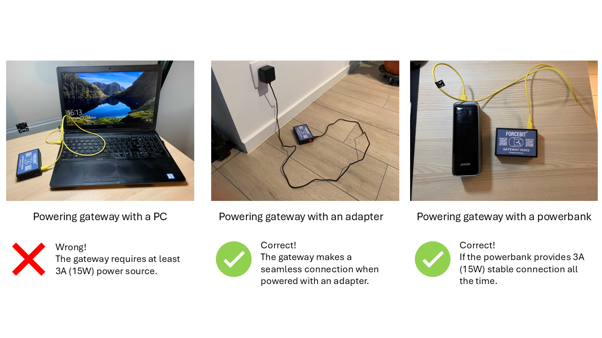](#powering-the-gateway)

A gateway has 2 modes:

1. connected mode: the gateway is connected and ready to receive commands.
2. sampling mode: the gateway is receiving data from the connected sensors and sending them to the computer.

Each sensor has a unique ID, which is written on the sensor box and also on the sensor itself.
A sensor has 3 modes: 

1. standby mode: the sensor is only advertising its presence to the nearby gateways. 
2. connected mode: the sensor is connected to a gateway and ready to receive commands.
3. sampling mode: the sensor is sampling the selected signals and sending them to the gateway.

**Important Note:** Sensors consume ~20x more power in connected mode than in standby mode.
Always disconnect sensors when not in use.

The sampling frequency and the number of channels depend on the sensor type:

* A Dot sensor has 3 channels (Ax, Ay, Az) and can sample up to 16 kHz per channel.
* An Accbit sensor has 4 channels (C1, C2, C3, C4), outputs 3 signals (angle, velocity and acceleration) and can sample up to 8 kHz per channel.
* A Telbit sensor has 5 channels (V1, V2, V3, V4, V5) and can sample up to 4 kHz per channel with ADC signals, and up to 8 kHz per channel without ADC signals.

| Sensor  | Max Sampling Frequency |
|---------|-------------------------|
| Dot     | &lt;= 16 kHz |
| Accbit  | &lt;= 8 kHz |
| Telbit  | &lt;= 4 kHz (ADC), &lt;= 8 kHz (non-ADC) |
| Aggregate | &lt;= 48 kHz |

A gateway can connect up to 6 sensors at the same time.
It has a limit of aggregated sampling frequency of 48 kHz.
Aggregated sampling frequency is the sum of the sampling rates of the channels of connected sensors.
If a Dot is sampling at 16 kHz with 3 channels (Ax, Ay, Az), it consumes 16 x 3 = 48 kHz from the aggregated sampling frequency.
If you sample an Accbit at 4 kHz and a Dot at 4 kHz with all channels, the aggregate sampling rate is 4 x 3 + 4 x 4 = 28 kHz.

## Product info

### Dot

The Dot is a small, wireless, triaxial accelerometer for measuring linear vibrations and shocks machinery.
You can find more information and technical specifications of the Dot sensor on [https://forcebit.eu/products/dot/](https://forcebit.eu/products/dot/).

### Accbit

The Accbit is a wireless, multi-axial encoder for measuring shaft angle, angular velocity and angular acceleration.
You can find more information and technical specifications of the Accbit sensor on [https://forcebit.eu/products/accbit/](https://forcebit.eu/products/accbit/).

### Telbit

The Telbit is a wireless, multi-axial telemetry system for measuring shaft angle, angular velocity, angular acceleration, strain and temperature.
You can find more information and technical specifications of the Telbit sensor on [https://forcebit.eu/products/telbit/](https://forcebit.eu/products/telbit/).

### Forcebit

The Forcebit is a wireless, multi-axial telemetry system for measuring shaft torque, bending moments and forces, along with shaft angle, angular velocity and angular acceleration.
You can find more information and technical specifications of the Forcebit sensor on [https://forcebit.eu/products/forcebit-1/](https://forcebit.eu/products/forcebit-1/).

## Disclaimer

This software is developed to perform wireless measurements with Forcebit sensors.
It is tested on Windows 10 and 11 operating systems.
The software is provided for free of charge for Forcebit customers.

## Requirements

* Operating system: Windows10 or higher.
* Memory: 1.2 GB free space at your hard drive.
* Processor: Minimum 2 core CPU with 2.0GHz or higher
* RAM: 4GB or higher

## Installation

* Please unzip `ForcebitSW.zip` to **a local drive (C:\ or D:\ drive) at your PC**, preferably with 7Zip [[download here](https://www.7-zip.org/download.html)]. The directory that you extract `ForcebitSW.zip` file is the [installation_path], e.g. `C:\ForcebitSW`.
* Save the provided sensor and gateway files to `[installation_path]\SensorAndGatewayFiles`.
* That's all! You are set to go.

## Connectivity Test

Before running any measurement, we strongly recommend performing a **connectivity test**.
The measurement data is streamed from the gateway to your PC over Wi-Fi, therefore a weak or slow Wi-Fi link causes packet loss, data gaps or aborted measurements.
The connectivity test checks the quality of the link between your PC and the gateway *before* you start measuring, and tells you what to fix if the link is not good enough.

**How to run the test:**

* Turn on your gateway by plugging it into a stable power source, see [powering the gateway section above](#powering-the-gateway-figure).
* Connect your PC to the `forcebit[ID]-gw` Wi-Fi of your gateway, e.g. `forcebit7-gw` for `GATEWAY 100007`.
* Go to the directory where `ForcebitSW` is installed.
* Double-click on `.\Connectivity_test.bat`. A small window opens and a console window (black screen) pops up next to it, printing the measured values every second.
* If there is only one gateway file in `[installation_path]\SensorAndGatewayFiles`, the gateway is loaded and connected automatically. If you have several gateways, drop the gateway file of the gateway you want to test onto the `Drop Gateway File Here` area (or press it to browse for the file).
* When the status line shows `Gateway connected. Ready to test.`, the `Start` button is enabled.

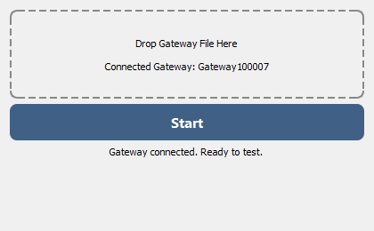

* Press `Start`. The test pings the gateway once per second for **15 seconds** and collects the round-trip latency, the Wi-Fi signal strength and the Wi-Fi receive rate. The progress bar shows the remaining test time.

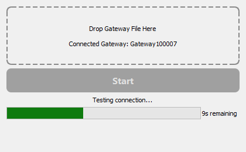

* Perform the test in the same position and with the same power setup that you will use during the measurement, since both the distance to the gateway and the power mode of your PC influence the result.

**Test criteria:**

The test averages the collected values over the 15 seconds and compares them to the following limits:

| Measured quantity | Limit | Meaning |
|---|---|---|
| Average latency | &lt; 10 ms | Round-trip time between your PC and the gateway. Higher values usually indicate a power saving problem. |
| Average signal strength | &gt; 15 % | Strength of the gateway Wi-Fi signal at your PC. Lower values indicate too much distance or obstacles. |

If both criteria are fulfilled, the test reports `Connection: Good` and you can continue with the measurement.

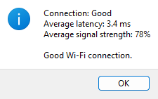

If one of the criteria fails, the test reports `Connection: Bad` together with the actions to take.

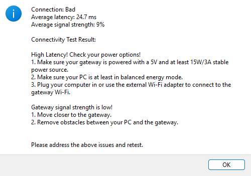

**What to do if the test fails:**

* **High latency:**
  1. Make sure your gateway is powered with a 5V and at least 15W/3A stable power source.
  2. Make sure your PC is at least in balanced energy mode (not in power save mode).
  3. Plug your computer in, or use the external Wi-Fi adapter to connect to the gateway Wi-Fi.
* **Low signal strength:**
  1. Move closer to the gateway.
  2. Remove the obstacles between your PC and the gateway.

After you have addressed the issues, press `Start` again to retest. Repeat the test until the connection is reported as `Good`.

**Note:** If the gateway connection is lost during the test, the test is aborted with a warning and you have to reconnect to the gateway Wi-Fi and start again.

## Measurements

## 1. How to run a measurement with GUI

* Turn on your gateway by plugging it into a stable power source, see [powering the gateway section above](#powering-the-gateway-figure).
* Check out the number written on your gateway, e.g. `GATEWAY 100007`. Then, 7 is the ID of your gateway.
* Connect to `forcebit[ID]-gw` Wi-Fi, in this case `forcebit7-gw`.
* Use the password instead of a PIN to access Forcebit Hotspot. Enter the password provided to connect to the Wi-Fi.
* Go to the directory that `ForcebitSW` is installed.
* Double-click on the `.\MainGUI.bat` and the GUI starts.

* First, the Main Menu will appear. In the main menu, you have 2 options:
  1. Measurement: Select Measurement if your sensors are already calibrated after mounting to the shaft or you want to perform linear acceleration measurements. The nulling of the load sensors (Telbit or Forcebit) can be done in the Measurement Window.
  2. Calibration: Select Calibration if you want to calibrate your Accbit, Telbit or Forcebit for rotational kinematics (angle, velocity and acceleration) after mounting to a shaft.

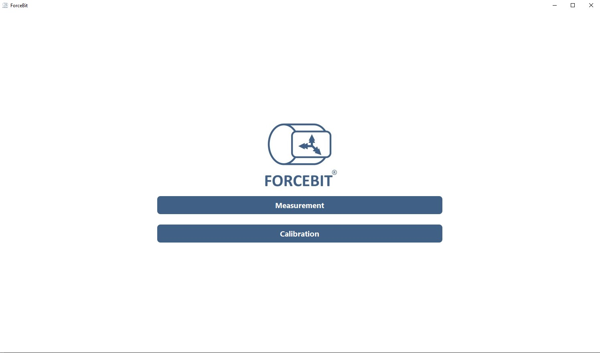

A console window (black screen) pops up to give you more information during the measurement process and for troubleshooting.

### 1.1 Measurement

1. The GUI starts from the `Connect` tab, where you can connect to the gateway and sensors.
If you have only one gateway, the GUI automatically connects to it.
For multiple gateways, press the `Drop Gateway File Here` button and select the desired file, or drag the gateway file from `[installation_path]\SensorAndGatewayFiles` into the designated area.
A successful gateway connection is indicated by the `Gateway connected` message in the status bar.
If the connection fails, ensure that your Wi-Fi is connected to `forcebit-gw`.

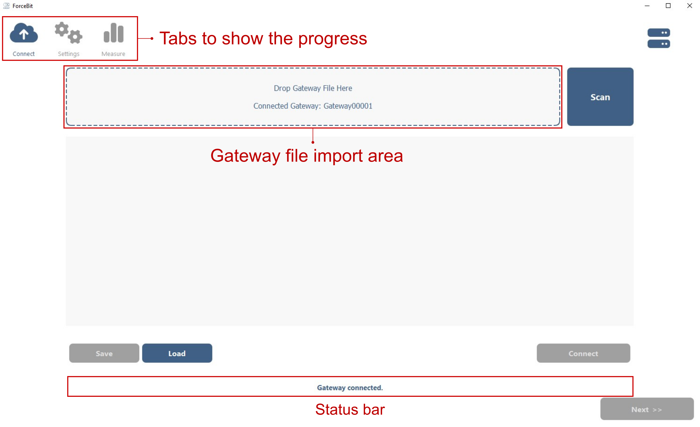

2. After the connection is successful, `Scan` button is enabled. Then, you press the `Scan` button to list the Forcebit sensors in the vicinity (&lt; 20m) which are not connected to a gateway. Please make sure the sensor has enough power by plugging it, if you cannot see a sensor in the list.  

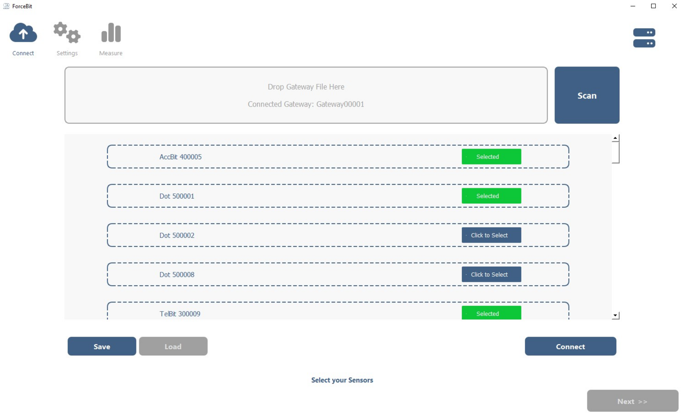

3. Please select the sensor you want to measure with and Press `Connect` button. This may take a while if you select more than 4 sensors at once **(max. 6 sensors)**. When all sensors connected, status bar notifies you with `Connected` message. You can also see the connected sensors at the top right.

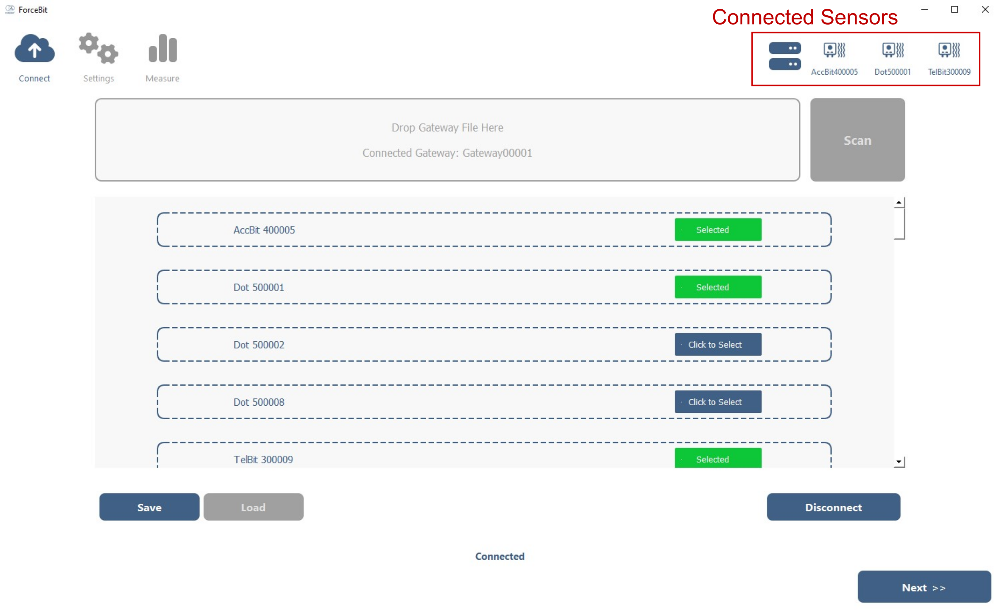

4. After the connection, the `Connect` button is replaced with `Disconnect` button. You can disconnect the sensors by pressing the `Disconnect` button. If you want to reconnect, you can select the sensors again and press `Connect` button. 


5. If you plan to use the sensor and gateway configuration later on, you can save the configuration by specifying the name and pressing the `Save` button. To a load a saved configuration, you can press the `Load` button and select the configuration. This will automatically select the gateway and sensors and connects to them.

6. After you are connected to the gateway and sensors, you can press the `Next` button to proceed to the `Settings` tab. 

7. In the settings tab, you can configure the measurement settings for each sensor. 
Each sensor has a dedicated box. You can select frequency, acceleration range and signal power for each sensor.
You can select signals to be sampled by checking the checkboxes of the desired signals.
Moreover, you can also set the folder where the measurement results are saved on the bottom left.

`Signal Power` sets the transmit power of the sensor. Higher values give a more robust link but drain the battery faster. If you also use the BAT files or your own scripts, the equivalent `txPower` values are:

| Signal Power | txPower |
|---|---|
| Minimum | -16 dB |
| Low | -8 dB |
| Medium | 0 dB (default) |
| High | 8 dB |

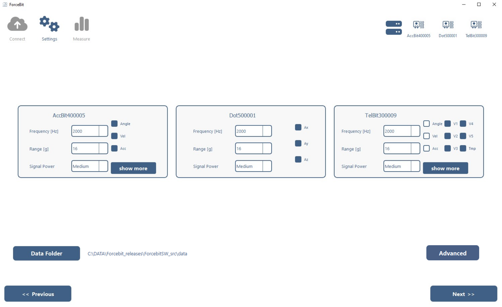

8. For Accbit and Telbit, if you want to measure the acceleration directly from the sensor, you can press the `show more` button to check the acceleration signals. ADC signals can be filtered with a low-pass 4th order Butterworth filter for Telbit. You can set the cut-off frequency in Hz from the dialog that pops-up with `show more` button.

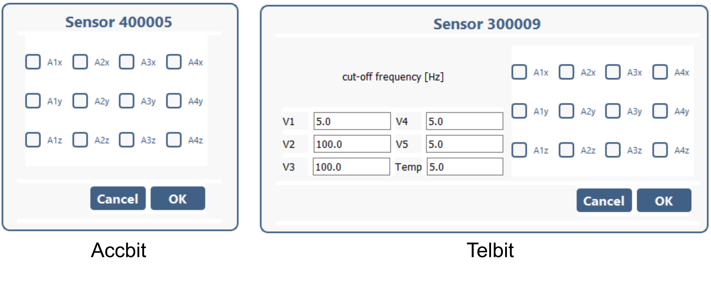
 
9. After setting the measurement settings, you can proceed to the `Measure` tab by pressing the `Next` button. GUI will set the sensor settings while proceeding to the `Measure` tab. This may take a while if you have many sensors connected.
The settings that are applied to the connected sensors are stored in `sensor_settings.txt` file in the `[installation_path]\temp` folder to be remembered for the next measurement.

10. In the `Measure` tab, you can set the measurement duration (as hours, minutes and seconds) at the bottom left and name the measurement run on the top right to access the results in the data folder. 
If you want to display specific signals on the plots, you can select the desired signals on the left panel of each plot.
The other controls of this tab are:
   * **Number of Plots:** how many plots are shown side by side. Each plot has its own signal selection panel.
   * **Time Window:** how many seconds of data the live plots show at a time.
   * **Downsampling:** plots every n-th sample instead of every sample. Increase it if the live plots stutter.

   For load sensors you can null the signals from this tab with the `Nulling` button, see [1.3 Nulling](#13-nulling).
   How the results are stored is set with the `Advanced` button in the `Settings` tab, see [1.4 Advanced Settings](#14-advanced-settings).

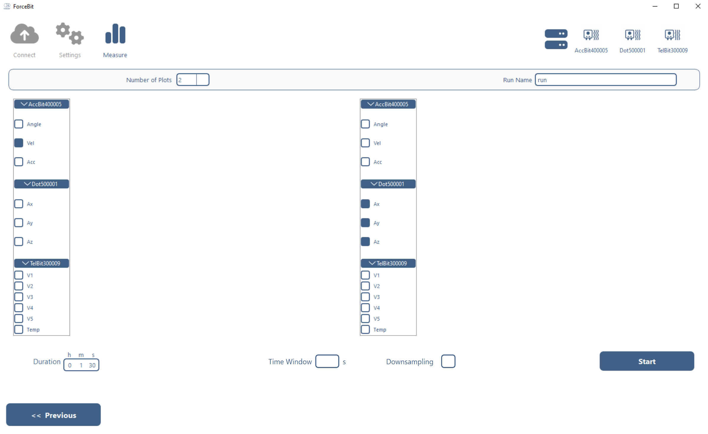

11. After you are set (or you are OK with default values), you can start the measurement by pressing the `Start` button.
After pressing the `Start` button, the gateway and sensor icons turn to <span style="color:green">green</span> and `Start` button turns to `Stop` button.
The live plots will be shown during the measurement if you selected any signals to display.
You can prematurely stop the measurement by pressing the `Stop` button.
Otherwise, the measurement stops automatically after the specified duration. 

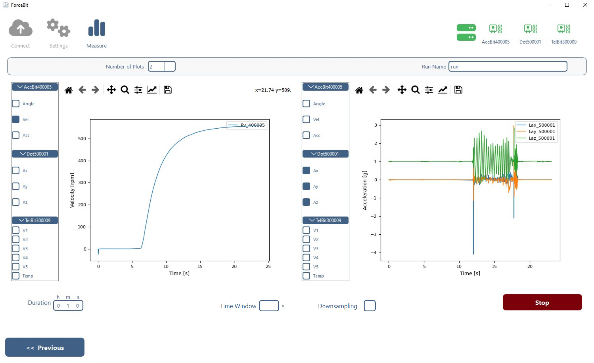

12. When the measurement is completed, the software performs clock synchronization if more than one sensor is used.
This may take several seconds depending on the number of sensors used and the measurement duration.
After the synchronization, the measurement results (`.h5` and/or `.csv` files, see [1.4 Advanced Settings](#14-advanced-settings)) and the plots are updated.
The sensor and gateway icons turn to <span style="color:blue">blue</span> showing that they are connected and ready for another measurement, and `Stop` button turns to `Start` button.
You can start another measurement by pressing the `Start` button again.

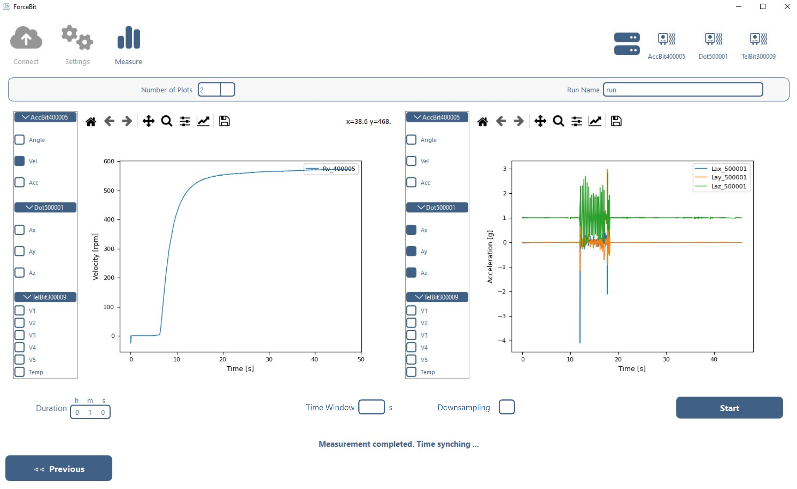

13. If you want to change the measurement settings, you can go back to the `Settings` tab by pressing the `Previous` button. If you want to change the connected sensors, you can go back to the `Connect` tab by pressing the `Previous` button twice.

14. If you are done with your measurements, you can close the Measurement Window with pressing the `X` button on the top right. Then it will ask you 3 options, 1. Go to Main Menu, 2. Exit and 3. Cancel. If you want to exit the software, you can press the `Exit` button. This will disconnect the sensors and gateway and close the software. If you want to do a calibration, you can press the `Go to Main Menu` button. This will disconnect the sensors and gateway and bring you to the main menu.

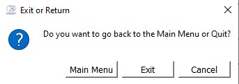

### 1.2 Calibration

The calibration is required after mounting the Accbit or Telbit to a shaft.
Every time you re-mount the sensor, or move it to another shaft, you have to calibrate it again.
The steps for calibration are similar to the measurement until the `Calibrate` Tab (steps 1-9). The differences are explained below:

* You can select only one Accbit or Telbit for calibration at a time.
* In the `Settings` tab, you can only set frequency, acceleration range and signal power. The signals to be measured are fixed for calibration: the four channels `C1` to `C4` of the sensor.
* It is advised to set the frequency and acceleration range as high as possible (8kHz and 16g) for better calibration results.

1. In the `Calibrate` tab, you can set the calibration duration at the bottom left.
Longer calibration durations generally produce more accurate results.
However, the calibration duration should be at least 3-5 min for a good calibration.
You can name the calibration run on the top right to access the results in the data folder.

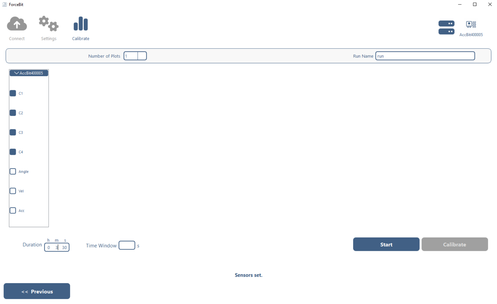

2. When you are ready, you can start the calibration by pressing the `Start` button.
After pressing the `Start` button, the gateway and sensor icons turn to <span style="color:green">green</span> and `Start` button turns to `Stop` button.
The live plots will be shown during the calibration with the calibration variables (accelerations). 
It is important to rotate the shaft in the speed range that you want to measure.
The best calibration procedure is to increase the speed step by step until the maximum speed and then decrease it step by step to median.
It is also  good practice to have high accelerations at low speeds to distinguish the accelerations from the speed components and noise.

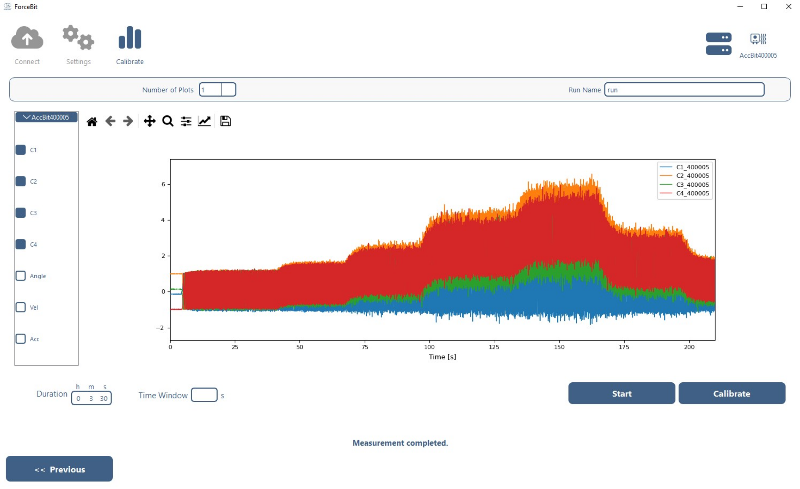

3. After the calibration measurement is completed, you can press the `Calibrate` button to perform the calibration.
This may take several seconds depending on the measurement duration.
After the calibration, the measurement results (in `Peripheral[nr]_[date/time].csv`  or `Peripheral[nr]_[date/time].h5` file) and the calibration results (in `calibrationPeripheral[nr]_[date/time].csv` or in `calibrationPeripheral[nr]_[date/time].h5` file) are saved in the selected data folder.

You can see the calibration results in the plots by selecting the desired signals on the signal selection panel on the left.
Now, you can use the calibrated sensor for measurements.
If you start a measurement with `Angle`, `Vel` or `Acc` selected for a sensor that has not been calibrated yet, the software stops the run and asks you to calibrate first, see the [FAQs](#calibration-and-nulling).

### 1.3 Nulling 

Our load sensors (Telbit and Forcebit) can be nulled to remove any offset in the strain and temperature measurements.
Along with the nulling, the user can also determine the sensitivity of the sensor by changing the gains of strain and temperature channels.
The steps for nulling are similar to the measurement until the `Measure` Tab (steps 1-9). 
Nulling is done at the Measurement Window in `Measure` tab.
Note that nulling requires at least one completed measurement: the dialog takes the last recorded sample as the reference value it has to compensate.
If no result file is available yet, it reports `No Result File` and asks you to run a measurement first.
The differences are explained below:

* You can select only one Telbit or Forcebit for nulling at a time.

1. When there is only one Telbit or Forcebit connected, the `Nulling` button is enabled.

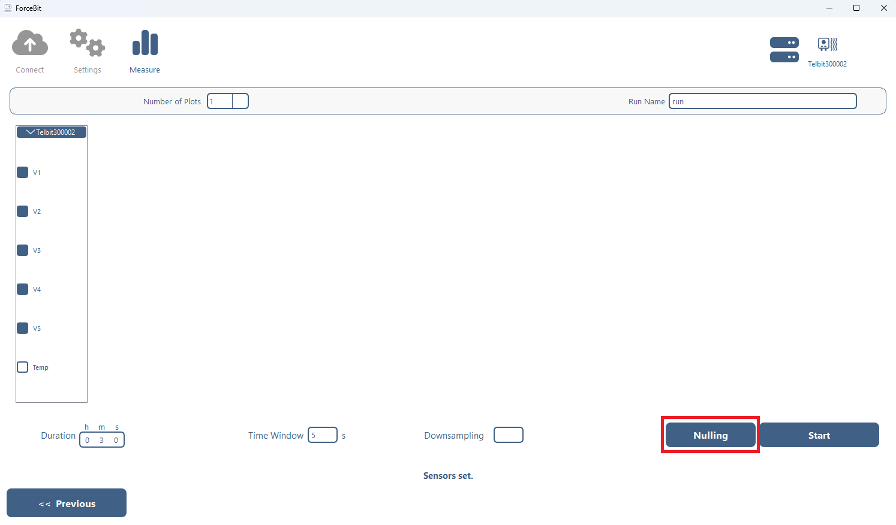

2. When the Nulling button is pressed, a dialog pops up. 
In the dialog, you can see two categories: electronic and numerical gains and offsets. 
The user should start setting electronic gains and offsets by setting the analog-digital-converter (ADC) values.

Electronic gains and offsets are the values that are set on the hardware side of the sensor.
   * The current ADC values of strain and temperature channels are displayed in the dialog. 
   * ADC gains scales an input signal's voltage to match the optimal measuring range of the converter. They can be selected between 1-5 integer values where 1 is the most sensitive and lowest range and 5 is the least sensitive, highest range. The default ADC gain value is 5, which is where the voltage is scaled between 0.6-3.0V.
   * ADC offsets are the values to be subtracted from the raw measurements on the hardware side. The default value is 2048 which is the midpoint of the ADC range, 12-bit. The user can set the ADC offsets between 0-4095 integer values.

Numerical gains and offsets are the values that are set on the software side of the sensor.
   * The gains are the multipliers for the raw measurements that defines the sensitivity of a channel. The default value for the gains is 1.
   * The offsets are determined at the end to correct any remaining measurement errors after applying the gains. The user can set the reference value for the signal and the offset is calculated automatically by the software. The default value for the offsets is 0. 

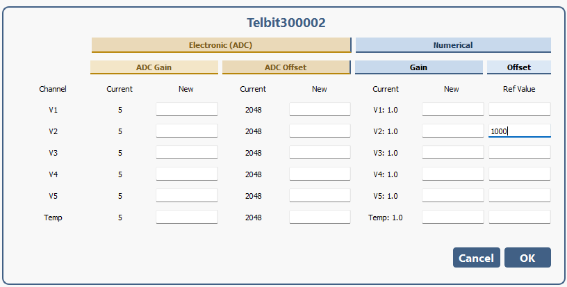

**Note:** When an ADC gain or offset is modified for a specific channel, the numerical gain and offset values are automatically reset to 1 and 0, respectively, for that channel.

3. You can do the nulling by selecting the values and pressing `OK` button in the ADC dialog during and in-between measurements. You can see that the nulling is successful by checking the live plots and seeing the `New ADC values set.` message on the status label.

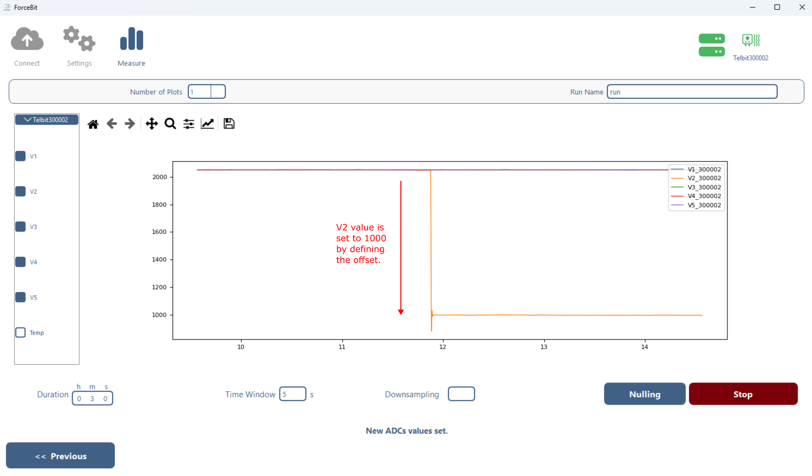

* It is advised to bring the channel into range with the ADC gains and offsets first, and to determine the numerical gains and offsets afterwards. Changing an ADC gain or offset resets that channel's numerical gain to 1 and its offset to 0, so any numerical values determined beforehand are lost.
* It is advised to choose a suitable time window, for example 5s, to see the effect of the changes in the plots if you do a live nulling.

**Example.** In the dialog above, `1000` is written in the `Ref Value` field of channel V2. This tells the software that V2 should read 1000 from now on. After pressing `OK`, the V2 trace in the live plot steps from about 2048 down to 1000, as shown in the figure above. 

### 1.4 Advanced Settings

In the `Settings` tab, you can press the `Advanced` button to open the `Advanced Settings` dialog and configure how the measurement results are stored.

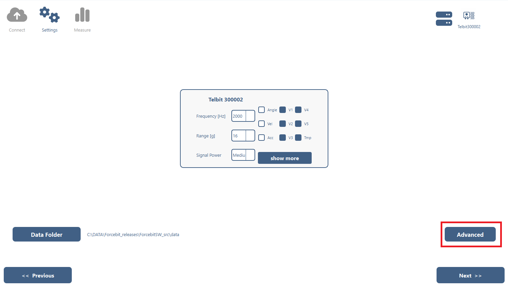

* **Save results automatically:** When checked (default), the measurement results are kept on disk automatically once a run completes. When unchecked, you are asked `Do you want to save the measurement results?` after each measurement. Answering `No` deletes the measurement folder; answering `Yes` keeps it.
* **Save figures after measurement:** When checked, a `.png` snapshot (200 dpi) of each plot is saved to the measurement folder after the run completes, named `[run_name]_figure_[n].png`. Unchecked by default.
* **Output Format:** Choose whether the results are stored as `HDF5 (.h5)` (checked by default), `CSV (.csv)` (unchecked by default), or both. If you only select `.csv`, the `.h5` files created during the measurement are automatically removed afterwards. If neither format is selected and `Save results automatically` is checked, you get a warning when closing the dialog, since the measurement data will not be saved to disk.
* **Telbit / Forcebit Data - Store raw ADC data (12-bit, unscaled):** This option is only shown when a Telbit or Forcebit sensor is connected. When checked, the V1–V5 and temperature channels are stored as the raw, unscaled 12-bit ADC counts instead of being converted with the gain and offset values. Unchecked by default.

When `CSV (.csv)` is selected, two more options appear:

* **Delimiter:** `Semicolon ( ; )` (default) or `Comma ( , )`. Choose the one your Excel expects.
* **Decimal separator:** `system` (default, follows your Windows setting), `dot` or `comma`. A comma cannot be used as delimiter and as decimal separator at the same time, so that combination is disabled.

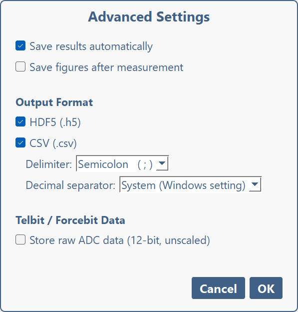

These settings are saved in `[installation_path]\temp\sensor_settings.txt` and are remembered for your next measurement.

## 2. How to run a measurement with BAT files 

### 2.1 Measurement 
Using the BAT file is a quick way to perform a measurement without using the GUI.

1. Turn on your gateway by plugging it into a power source.
2. Check out the number written on your gateway, e.g. `GATEWAY 100007`. Then, 7 is the ID of your gateway.
3. Connect to `forcebit[ID]-gw` Wi-Fi, in this case `forcebit7-gw`.
4. Go to the directory that `ForcebitSW` is installed.
5. Select the gateway that you will host and the sensors that you use for measurement in `gateway_and_sensor_selection.txt`. The user can find the sensor and gateway file in `[installation_path]\SensorAndGatewayFiles`. **Select maximum 6 sensors.** Just select the file names (without the extension) like in the example below:

```
Gateway00001
Dot500001
Accbit400005 
Telbit300009 
Dot500002 001
```

* `Gateway00001` represents the server to be selected. 
* `Dot500001` selects the Dot sensor with sensor number 500001. 
* `Accbit400005` selects the Accbit sensor with sensor number 400005.
* `Telbit300009` selects the Telbit sensor with sensor number 300009.
* `Forcebit200009` selects the Forcebit sensor with sensor number 200009.
* `Dot500002 001` line selects the dot sensor with sensor number 500002 but only measures acceleration in z-direction (Az).
If no number is indicated the signals will be selected as default.

Here is the syntax for signal selection for each sensor:

**Dot**

* 3 digits select the axes `Ax`, `Ay`, `Az` individually.
* Default: all three axes.

Examples:

* `Dot500002` : means Ax, Ay, Az are measured by default.
* `Dot500002 001` : means only Az is measured.
* `Dot500002 101` : means Ax and Az are measured.

**Accbit**

* 12 digits select the accelerations `A1x, A1y, A1z, A2x, ... A4z`, e.g. `100100100100` selects the tangential acceleration `Ax` of all 4 accelerometers.
* 3 digits switch angle, velocity and acceleration on or off together. Write `000` to turn them off.
* Default: angle, velocity, acceleration.

Examples:

* `Accbit400005` : means angle, velocity, acceleration are measured by default.
* `Accbit400005 100100100100` : means the tangential acceleration `Ax` of all 4 accelerometers is measured along with angle, velocity, acceleration.
* `Accbit400005 000 100100100100` : means Ax for all 4 sensors are measured but no angle, velocity, acceleration.

**Telbit and Forcebit**

* 6 digits select the load and temperature channels `V1, V2, V3, V4, V5, Temp`.
* 12 digits select the accelerations `A1x, A1y, A1z, A2x, ... A4z`.
* 3 digits switch angle, velocity and acceleration on or off together. Write `000` to turn them off.
* Default: angle, velocity and acceleration only. The load channels are measured only if you write the 6-digit group.

Examples:

* `Telbit300009` : means only angle, velocity and acceleration are measured. The ADC channels V1-V5 and Temp are not sampled.
* `Telbit300009 111111` : means only ADC signals V1, V2, V3, V4, V5, Temp are measured.
* `Telbit300009 111 111111` : measures all ADC signals together with angle, velocity and acceleration.
* `Telbit300009 000 100100100100` : means Ax for all 4 accelerometers are measured but no ADC signals, angle, velocity, acceleration.
* `Telbit300009 011000 100100100100` : means V2, V3 and Ax for all 4 accelerometers are measured but no angle, velocity, acceleration.
* `Telbit300009 111` : means that Telbit is used as an Accbit and only angle, velocity and acceleration are measured.
* `Forcebit200009 111111` : means only the load and temperature channels of the Forcebit are measured.

It is also possible to comment out some of the sensors during the sensor selection by adding `#` symbol at the beginning of the line. In the example below, the Dot500014 will not be used in the measurement.

```
Gateway00001
# Dot500014
Dot500015 001
```

Before running the measurement, you can set the filter values for a telbit sensor in `\temp\filters_[peripheral number].txt` file.
Also it is possible to set ADC gains and offsets in `\temp\ADC_values_[peripheral number].txt` file for load sensors (Telbit and Forcebit) before the measurement.

1. Set the measurement settings by editing `measurement_settings.txt`. The measurement settings are: 
  * **frequency:** the frequency of the sampling of the selected sensors as an `int`.
  * **ARange:** the measurement range of the accelerometer in g as an `int`. ARange value can be selected from a discrete set [2, 4, 8, 16]. You must set acceleration range based on the expected acceleration levels. If the acceleration range is set too low, the sensor may saturate and the measurement will be invalid. If the acceleration range is set too high, the resolution of the measurement decreases. 
  * **txPower:** the signal strength of the peripheral in dB as an `int` type. txPower value can be selected from [-20, -16, -12, -8, -4, 0, 4, 8]. Higher values mean higher signal strength, but also higher power consumption.
  * **measurementTime:** the measurement duration per loop as `HH:MM:SS`, e.g. `00:01:30` for one and a half minutes. This is not an integer number of seconds.
  * **loops:** the number of loops to be performed as an `int`. Total measurement time = measurementTime x loops.
  * **saveDataFolder:** the name of the folder (as `string`) where measurement results are saved `.\data\[saveDataFolder]`.
  * **diameter:** the shaft diameter in mm as an `int`, used by Accbit and Telbit. The default is 48 mm. Set it to your shaft, otherwise the rotational results are wrong.
  * **timeWindow:** the width of the live plot in s as an `int`.
  * **downsampling:** plots every n-th sample instead of every sample, as an `int`. Increase it if the live plots stutter.

**Note:** The 48 kHz aggregate sampling rate limit also applies here, see [General info](#general-info). Unlike the GUI, the BAT files do not warn you when you exceed it.

2. Double-click on `clickRun.bat`. A command prompt will pop-up. The program will connect to the gateway, the gateway will scan the sensors in vicinity and connect the selected sensors if they are in range and charged.

**Note:** For long measurements, it is advised to run without live plotting to avoid any display issues during the measurement. You can do this by double-clicking `clickRunNOPLOT.bat`. 
You can also split your measurement into several pieces by setting the number of loops and measurement time per loop in `measurement_settings.txt`.


3. When the user is ready, please press any key to start the measurement on the main command prompt. By pressing the button, the measurement will start and a live plot will pop up for each sensor.

### 2.2 Calibration

The calibration is done in a similar fashion with measurement with `clickCalibrate.bat` file. 

* You can set the calibration time with `measurementTime` in `measurement_settings.txt`, e.g. `00:05:00` for 5 minutes. It is advised to set the calibration time at least 3-5 min for a good calibration.
* The rest of the settings are taken by default:
  * **frequency:** 8000 Hz
  * **ARange:** 16 g
  * **txPower:** 0 dB

* You can select only one Accbit or Telbit for calibration at a time in `gateway_and_sensor_selection.txt`.
* The signals to be measured are fixed for calibration. You cannot change them in `gateway_and_sensor_selection.txt`. Therefore, just write the sensor file name without any signal selection.

Example:
```
Gateway00001
Accbit400001 
```

* After measurement settings and sensor selection is done, please double-click on `clickCalibrate.bat`. A command prompt will pop-up. The program will connect to the gateway, the gateway will scan for the selected sensor and connect to it if it is in range and charged.
* When the user is ready, please press any key to start the calibration on the command prompt. By pressing the button, the calibration measurement will start and a live plot will pop up for the sensor.
* After the calibration measurement is completed, calibration procedure starts automatically. And at the end of the calibration, the states (angle, velocity and acceleration) will be displayed in the plot.

## 3. How to integrate Python script into your application

The essential functionalities of the measurement software can be found in `Measurement.py`. 
It is a good template, therefore, please take a copy of the original `Measurement.py` file or modify it at your own risk. 
After creating a copy, `Measurement.py` is at your disposal to understand and debug the code and its functionalities.

### 3.1 Using Python Scripting with Pycharm 

Pycharm is a convenient IDE for many python users.
What you need to do to run or debug your python application using PyForcebit measurement functions and modules is listed as follows:

1. Download and install Pycharm community edition to your computer from clicking this [link](https://www.jetbrains.com/pycharm/download/?section=windows), if you don't have one. (optional)
2. Open the `ForcebitSW` folder at your `installation_path`.
3. Set the Python interpreter to `.\PyForcebit\python.exe`.
   1. See the general view below, you can have two options: 1. setting manually, 2. Pycharms automatically sets PyForcebit for you.

   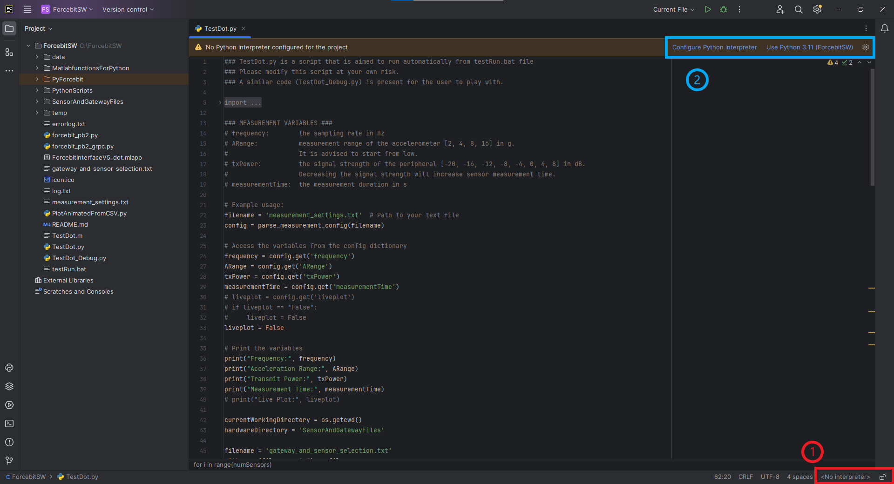

   2. If you go with manual selection press, "No Interpreter" tab. Then, this tab will open:

   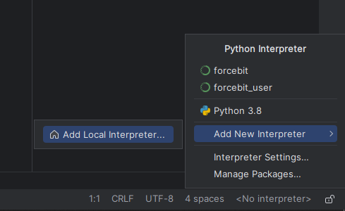

   3. Select Add New Interpreter > Add local Interpreter.

   4. A window pops up below:

   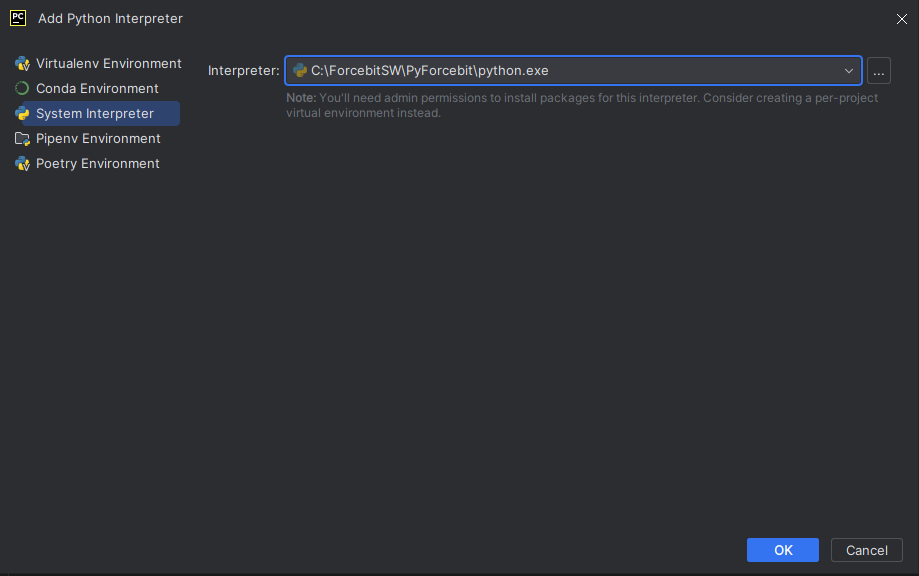

   5. Select "System Interpreter" and browse to the `.\PyForcebit\python.exe`.

4. Run or debug the python code using the button's shown below. It is possible to set a breakpoint at any line and watch the local variables in the code.

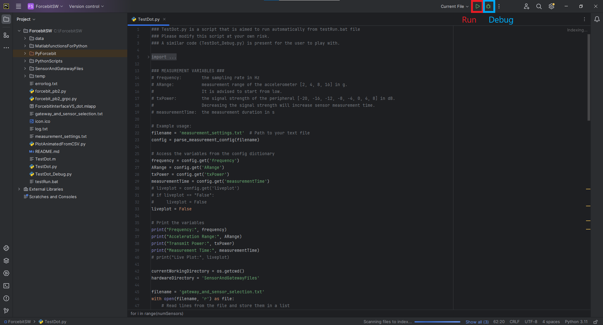

### 3.2 Using Command Prompt

Turn on the gateway, read its ID from the label (e.g. `7` for `GATEWAY 100007`) and connect your PC to the `forcebit[ID]-gw` Wi-Fi, as described in the [GUI section](#1-how-to-run-a-measurement-with-gui).

1. Open the command prompt by pressing the `Win` key and type `Command Prompt`.
2. Go to installation folder by using `cd [installation folder]`
3. Activate the dedicated python by `.\PyForcebit\Scripts\activate.bat`.
4. Run your python code on the command prompt, e.g. `python Measurement.py`.
You can also debug your code in command prompt using the debug module in python, e.g. `python -m pdb Measurement.py`.
Check the official Python website to learn how to use pdb for debugging [here](https://docs.python.org/3/library/pdb.html).
5. Deactivate the python by `deactivate`.

## 4. How to integrate Matlab script into your application

The utility functions are stored in the `MatlabfunctionsForPython` folder.
Here you can find all the necessary functions to perform a measurement or a calibration.
`Measurement.m`, which sits in `[installation_path]` itself, serves as a reference on how to integrate the Matlab functions into your scripts.
It covers all the steps described in Measurement with GUI above:

* Selecting the gateway and connecting to it,
* Creating sensor instances,
* Scanning for the sensors,
* Connecting the selected sensors if they were in scanned sensors,
* Setting the measurement settings and signals to measure for different type of sensors,
* Performing the measurement for a predefined time,
* Reading the measurement results and live plotting,
* Disconnecting sensors,
* Postprocessing after the run (e.g. clock synchronization),
* Disconnecting the gateway.

Similarly, `Calibrate.m`, also in `[installation_path]`, shows how to calibrate an Accbit or Telbit.

Note that your Matlab script uses `PyForcebit` Python interface to call the functions in `MatlabfunctionsForPython` folder.
If you used another python environment for a different purpose before Forcebit scripting, you have to restart Matlab to use the PyForcebit python environment.
You can check which python environment is used by Matlab by `pyenv` command and it has to point to `PyForcebit` in order to use Matlab scripting.
If it does not, set it once with:

```matlab
pyenv(Version="[installation_path]\PyForcebit\python.exe")
```

You can find more information about Matlab-Python integration [here](https://www.mathworks.com/help/matlab/matlab_external/install-supported-python-versions.html).

<!-- ```matlab
clear all, %close all; clc;

tic

% we add the appropriate path
addpath('MatlabfunctionsForPython')

currentWorkingDirectory = pwd;
Gateway00001 = fullfile(currentWorkingDirectory, 'SensorAndGatewayFiles', 'Gateway00001.txt');
mysensor1 = fullfile(currentWorkingDirectory, 'SensorAndGatewayFiles', 'Telbit300010.txt');
mysensor2 = fullfile(currentWorkingDirectory, 'SensorAndGatewayFiles', 'Dot500010.txt');
mysensor3 = fullfile(currentWorkingDirectory, 'SensorAndGatewayFiles', 'Accbit400005.txt');

sensors = {
mysensor1,
mysensor2,
mysensor3,
};
numSensors = size(sensors,1);
sensorNrList = [];

utils = includePythonLibraries();

% read gateway & sensor
[myrun, success, message] = ReadGateway(utils, Gateway00001, false, false);
if ~success
    error(message);
end
for i=1:numSensors
    [Peripheral, myrun, success, Nr, message]   = CreatesAsensorInstance(utils, myrun,sensors{i});
    sensorNrList = [sensorNrList; Nr];
end

 % readCPUtemperatureGateway(myrun)

% set the location where to drop your fies
path = fullfile(currentWorkingDirectory, 'data');
folder = 'here'; 

% scan to get all your peripherals
[Peripheral, myrun, success] =  Scan(utils, myrun);

% process only when all peripherals are found in the scanning process
if ~areallPeripheralsScanned(utils, myrun)
    error('Not all peripherals are scanned. Execution stopped.');
end

% we connect to the peripheral
[Peripheral, myrun, success] = Connect(utils, myrun);

for i=1:numSensors
    Nr =  sensorNrList(i);
    if Nr >= 500000 && Nr < 600000 % dot
        Peripheral(i).A1x = 1;
        Peripheral(i).A1y = 1;
        Peripheral(i).A1z = 1;
        Peripheral(i).samplerate = 2000; %Hz
        Peripheral(i).Arange = 16; % 4-16g range
        Peripheral(i).txPower = 0; % 0dB default
    elseif Nr >= 400000 && Nr < 500000 % accbit
        % Peripheral(i).A1x = 1;
        Peripheral(i).combo=1;
        Peripheral(i).samplerate = 2000; % Hz
        Peripheral(i).Arange = 16; % 4-16g range
        Peripheral(i).txPower = 0; % 0dB default
    elseif Nr >= 300000 && Nr < 400000 % telbit
        DACfilename = sprintf('./temp/DAC_values_%d.txt', Nr);
        if exist(DACfilename, 'file')
            DAC_values = readmatrix(DACfilename);  % or use load() if it's pure numeric
            Peripheral(i).DAC1 = DAC_values(1);
            Peripheral(i).DAC2 = DAC_values(2);
            Peripheral(i).DAC3 = DAC_values(3);
            Peripheral(i).DAC4 = DAC_values(4);
            Peripheral(i).DAC5 = DAC_values(5);
            Peripheral(i).DAC6 = DAC_values(6);
        else
            % default DAC values
            Peripheral(i).DAC1 = round(2048 * 1.0);
            Peripheral(i).DAC2 = round(2048 * 1.0);
            Peripheral(i).DAC3 = round(2048 * 1.0);
            Peripheral(i).DAC4 = round(2048 * 1.0);
            Peripheral(i).DAC5 = round(2048 * 1.0);
            Peripheral(i).DAC6 = round(2048 * 1.0);
        end
        % set DAC values
        setDAC(myrun,Peripheral(i));
        % filters
        channels = {'V1', 'V2', 'V3', 'V4', 'V5', 'T'}; % channels to be filtered
        cutoff = [5, 100, 100, 5, 5, 5]; % Hz
        setFilter(myrun, Nr, channels, cutoff); 
        % selecting signals to sample
        Peripheral(i).combo = 1; % means angular acceleration, velocity and angle
        Peripheral(i).V1 = 1;
        Peripheral(i).V2 = 1;
        Peripheral(i).V3 = 1;
        Peripheral(i).V4 = 1;
        Peripheral(i).V5 = 1;
        Peripheral(i).Temp = 1;
        % Peripheral(i).A1x = 1;
        % Peripheral(i).A2x = 1;
        % Peripheral(i).A3x = 1;
        % Peripheral(i).A4x = 1;
        % measurement settings
        Peripheral(i).samplerate = 2000; % Hz
        Peripheral(i).Arange = 16; % 4-16g range
        Peripheral(i).txPower = 0; % 0dB default
    else
        error(sprintf('Sensor %d is not recognized', Nr));
    end
end
[Peripheral, succes] = setSensor(utils, myrun, Peripheral);
 
% start the measurement
measurementTime = 30; % in s
refresh = 1;

disp('starting the measurement')
[Peripheral, myrun, foldername] = SetFastRun(utils, myrun, measurementTime,Peripheral, path, folder); 

% plot the data
screenSize = get(0, 'ScreenSize');
screenSize_x = screenSize(3);
screenSize_y = screenSize(4);
margin_x = 50;
margin_y = 50;
plotsize_x = 600;
plotsize_y = 600;
numScreens = 0;

figures = gobjects(1, numSensors);
next_x = margin_x;
next_y = margin_y;
for i = 1:numSensors
    figures(i) = figure('Position',[next_x, next_y, plotsize_x, plotsize_y]); % Create a new figure and store its handle
    next_x = next_x + plotsize_x;
    if (next_x > screenSize_x)
        next_x = margin_x;
        next_y = next_y + plotsize_y;
        if next_y > screenSize_y
            % screen is full - create a new screen
            next_y = margin_y;
            numScreens = numScreens + 1;
            next_x = next_x + numScreens * margin_x;
            next_y = next_y + numScreens * margin_y;
        end
    end
end

done = 0;
run=[];
while ~done

    % read CSV and extract measurement data
    [run, slowtable, done] = readMeasurementFolder(foldername, run);

    for i=1:numSensors
        figure(figures(i));
        Nr =  sensorNrList(i);
        if(run(i).length > 0)
            if Nr >= 500000 && Nr < 600000 % dot
                legends = {};
                for j = 1:numel(run(i).ArrayofVariables)
                    plot(run(i).time,run(i).data(:,j)); hold on; grid on;
                    titleStr = split(run(i).ArrayofVariables{j}, '_');
                    legends{end+1} = titleStr{1};
                end
                hold off;
                xlabel('Time [s]');
                ylabel('Acceleration [g]')
                legend(legends);
                globalTitleStr = strcat("Sensor ", titleStr{2});
                title(globalTitleStr)
            elseif Nr >= 400000 && Nr < 500000 % accbit
                for j = 1:numel(run(i).ArrayofVariables)
                    unitLabel = findUnitFromVarName(run(i).ArrayofVariables{j});
                    subplot(numel(run(i).ArrayofVariables),1,j)
                    plot(run(i).time,run(i).data(:,j));
                    xlabel("Time [s]");
                    ylabel(unitLabel);
                    titleStr = split(run(i).ArrayofVariables{j}, '_');
                    localTitleStr = titleStr{1};
                    title(localTitleStr);
                end
                globalTitleStr = strcat("Sensor ", titleStr{2});
                sgtitle(globalTitleStr, 'FontWeight', 'bold')
            elseif Nr >= 300000 && Nr < 400000 % telbit
                numCols = 3;
                for j = 1:numel(run(i).ArrayofVariables)
                    unitLabel = findUnitFromVarName(run(i).ArrayofVariables{j});
                    subplot(ceil(numel(run(i).ArrayofVariables)/numCols),numCols,j)
                    plot(run(i).time,run(i).data(:,j));
                    xlabel("Time [s]");
                    ylabel(unitLabel);
                    titleStr = split(run(i).ArrayofVariables{j}, '_');
                    localTitleStr = titleStr{1};
                    title(localTitleStr);
                end
                globalTitleStr = strcat("Sensor ", titleStr{2});
                sgtitle(globalTitleStr, 'FontWeight', 'bold')
            end
        end
    end
    pause(refresh)
end

% disconect sensor
[Peripheral, myrun, success] = Disconnect(utils,myrun);
if success
    fprintf("Sensors disconnected!\n");
end

% post-processing
[myrun, success] = Postprocessing(utils, myrun, foldername);

% clean-up
killclient(utils,myrun)

``` -->

## Frequently Asked Questions (FAQs)

This section collects the questions we receive most often about the usage of the Forcebit software.
The answers refer to the sections above, where the topic is explained in detail.
If your question is not answered here, please contact us at [https://www.forcebit.eu](https://www.forcebit.eu).

### Installation and Setup

<details>
<summary><b>Q:</b> Do I have to install Python or any other software before I can use the Forcebit software?</summary>

**Answer:** No. `ForcebitSW.zip` already contains its own Python environment (`PyForcebit`) with all required libraries. You only need to unzip the package and start the `.bat` files.

**See also:** [Installation](#installation)

</details>

<details>
<summary><b>Q:</b> Where do I have to extract <code>ForcebitSW.zip</code>?</summary>

**Answer:** Extract it to a local drive of your PC, e.g. `C:\ForcebitSW` or `D:\ForcebitSW`. This folder is what the manual calls the `[installation_path]`.

Do not run the software from inside the `.zip` file, or do not extract it to cloud or a shared drive.  Extracting with [7-Zip](https://www.7-zip.org/download.html) is recommended. 
Please make sure that the path you extracted does not include special characters.

**See also:** [Installation](#installation)

</details>

<details>
<summary><b>Q:</b> The GUI shows <code>No Sensor Files Found</code>. What is missing?</summary>

**Answer:** The folder `[installation_path]\SensorAndGatewayFiles` is empty or does not exist. This folder must contain the `.txt` gateway and sensor files that were provided with your hardware, e.g. `Gateway00007.txt` and `Telbit300009.txt`.

**Steps:**
1. Copy all provided `.txt` files into `[installation_path]\SensorAndGatewayFiles`.
2. Restart the GUI.

**See also:** [Installation](#installation)

</details>

<details>
<summary><b>Q:</b> I double-click <code>MainGUI.bat</code> and the console window (black screen) closes immediately.</summary>

**Answer:** The `.bat` files activate the bundled Python environment with a relative path, so they only work from inside the installation folder.

**Steps:**
1. Make sure you double-click the `.bat` file in `[installation_path]` itself, and not a shortcut or a copy on your desktop.
2. Check that the folder `[installation_path]\PyForcebit` exists. If it does not, the package was not extracted completely — unzip it again (preferably with 7-Zip).
3. If the window still closes, open a command prompt in `[installation_path]`, run `MainGUI.bat` from there, read the error message that stays on the screen and contact us with that information.

</details>

### Gateway and Sensor Connection

<details>
<summary><b>Q:</b> The gateway does not connect and I get <code>Error in gateway</code> or <code>Please reconnect the gateway and try again</code>.</summary>

**Answer:** In almost all cases the PC is not (or no longer) connected to the Wi-Fi of the gateway.

**Steps:**
1. Check that the gateway is powered from a 5V source that supplies at least 15W/3A. An underpowered gateway boots, but its Wi-Fi becomes unstable.
2. Check your Wi-Fi connection. It must be `forcebit[ID]-gw`, where `[ID]` is derived from the number on the gateway, e.g. `forcebit7-gw` for `GATEWAY 100007`.
3. If Windows asks for a PIN, choose the option to enter the **password** instead and use the password provided with your gateway.
4. Make sure you dropped the gateway file that belongs to *this* gateway. A file of another gateway points to an address that does not answer.
5. Run the [Connectivity Test](#connectivity-test) to confirm that the link works before you continue.

**See also:** [Connectivity Test](#connectivity-test)

</details>

<details>
<summary><b>Q:</b> Why can I not see my sensor in the list after pressing <code>Scan</code>?</summary>

**Answer:** The scan only lists sensors that are within range and are **not** connected to a gateway.

| Possible cause | What to do |
|---|---|
| The sensor is out of battery | Plug the sensor in and charge it, then scan again |
| The sensor is more than ~20 m away or behind an obstacle | Move the sensor or the gateway closer |
| The sensor is still connected to a gateway (of yours or of a colleague) | Disconnect it in the software that holds it, or power your  gateways off and on |
| The sensor was just disconnected | Wait a few seconds and press `Scan` again |

**See also:** [1.1 Measurement](#11-measurement)

</details>

<details>
<summary><b>Q:</b> A sensor appears in the list as <code>Unlisted sensor</code> with a long hexadecimal name and cannot be selected.</summary>

**Answer:** The gateway found a Forcebit sensor for which your installation has no configuration file, so the software can only show its MAC address and does not know its type or calibration data.

**Steps:**
1. Check whether the `.txt` file of that sensor is present in `[installation_path]\SensorAndGatewayFiles`.
2. If it is missing, copy the file that was provided with the sensor into that folder and restart the GUI.
<!-- 3. If it is not your sensor (for example a colleague's sensor nearby), simply ignore the entry. -->

</details>

<details>
<summary><b>Q:</b> The status bar shows <code>Error in connection: [sensor name]</code>. What went wrong?</summary>

**Answer:** The gateway could not establish the connection to the listed sensor(s) within the expected time. The other sensors of the selection may have connected normally.

**Steps:**
1. Charge the listed sensor, or plug it in.
2. Reduce the distance to the gateway and press `Connect` again.
3. Give the connection enough time. Connecting more than four sensors in one go takes noticeably longer, so wait until the status bar reports the result before you press `Connect` again.
4. If the same sensor keeps failing, select it on its own to check whether the problem is with that sensor.

</details>

<details>
<summary><b>Q:</b> During the measurement I get <code>Connection Lost - Gateway connection lost. Returning to connection page.</code></summary>

**Answer:** The software continuously checks the PC-gateway connection and returns to the `Connect` tab as soon as the gateway stops answering. This is a Wi-Fi connection problem, not a sensor problem.

**Steps:**
1. Reconnect your PC to the `forcebit[ID]-gw` Wi-Fi.
2. Make sure Windows does not switch back to another known network automatically. Disable the automatic connection of your office/home Wi-Fi while measuring.
3. Set your PC to at least the balanced energy mode and plug it in — power saving can switch off the Wi-Fi adapter.
4. Run the [Connectivity Test](#connectivity-test) before the next measurement.

</details>

<details>
<summary><b>Q:</b> How many sensors can I use at the same time?</summary>

**Answer:** Up to **6 sensors** per gateway, and the sum of all sampled channels must stay within 48 kHz. For calibration, only **one** sensor can be selected at a time.

**See also:** [General info](#general-info)

</details>

<details>
<summary><b>Q:</b> Can I use an Ethernet cable instead of Wi-Fi?</summary>

**Answer:** Yes, but the gateway must be reached over Wi-Fi at least once so that the Ethernet connection is set up correctly. After that you can connect the gateway with an Ethernet cable.

**See also:** [General info](#general-info)

</details>

### Measurement and Settings

<details>
<summary><b>Q:</b> I get <code>Aggregate Sampling Rate Exceeded - Please ask up to 48kHz in aggregate</code>.</summary>

**Answer:** The gateway can handle 48 kHz in total over all connected sensors. The aggregate is the sum of (number of selected signals × sampling rate) of every sensor.

**Steps:**
1. Lower the sampling rate of sensors. (Note that keeping the same sampling rate for every sensor gives the best performance.)
2. Deselect the signals you do not need.
3. Or use fewer sensors in the same run.

For example, one Dot at 16 kHz with `Ax`, `Ay`, `Az` already uses 3 × 16 = 48 kHz, so no other sensor fits next to it.

**See also:** [General info](#general-info)

</details>

<details>
<summary><b>Q:</b> I get <code>Sampling Rate Too High</code> although the rate is offered in the drop-down list.</summary>

**Answer:** The maximum rate depends on the signals you selected, and the software blocks the run instead of delivering channels the sensor cannot sample:

| Selected signals | Maximum sampling rate |
|---|---|
| `V1`–`V5` or `Temp` (ADC channels of Telbit/Forcebit) | 4 kHz |
| `Angle` / `Vel` / `Acc` (needs all four accelerometers `A1x`–`A4x`) | 8 kHz |
| More than 3 acceleration signals | below 16 kHz |

Either lower the sampling rate, or deselect the signals that impose the limit.

**See also:** [1.1 Measurement](#11-measurement)

</details>

<details>
<summary><b>Q:</b> I get <code>Calibration File Missing - Please calibrate the sensor [nr] before running the measurement</code>.</summary>

**Answer:** You selected `Angle`, `Vel` or `Acc` for an Accbit or Telbit that has not been calibrated on this shaft yet. These signals are estimated and therefore need the calibration data.

**Steps:**
1. Close the Measurement Window, go back to the Main Menu and choose `Calibration`.
2. Calibrate the sensor as described in [1.2 Calibration](#12-calibration).
3. Return to `Measurement` and start the run again.

If you only need raw accelerations, deselect `Angle`/`Vel`/`Acc` and select the acceleration signals in the `show more` dialog instead.

**See also:** [1.2 Calibration](#12-calibration)

</details>

<details>
<summary><b>Q:</b> A <code>Warning (ADC Clipping)</code> box pops up during the measurement, e.g. <code>Sensor 3: Mz is clipping above 4095.</code></summary>

**Answer:** The 12-bit ADC of a Telbit/Forcebit channel has reached the end of its range (0 or 4095), or is within the final 5% of it. The samples of that channel are cut off and therefore not usable. The message lists the channels that are in trouble *at that moment*; a channel that recovers disappears from the box by itself.

**Steps:**
1. Press `Nulling` and correct the offset of the affected channel so that the signal is centred again.
2. If the signal is too large for the range, lower the ADC gain of that channel (5 is the widest range, 1 the most sensitive).
3. Restart the measurement, since the clipped part of the recorded data cannot be recovered.

The box is non-modal, so the live plots and the `Stop` button stay usable while it is open.

**See also:** [1.3 Nulling](#13-nulling)

</details>

<details>
<summary><b>Q:</b> Why does it take so long when I press <code>Next</code> from the <code>Settings</code> tab to the <code>Measure</code> tab?</summary>

**Answer:** The settings are written to every connected sensor at that moment, which takes time proportional to the number of sensors. The status bar shows `Setting sensors, please wait...` while this happens. The applied settings are stored in `[installation_path]\temp\sensor_settings.txt` and are reused for the next measurement.

If it takes much longer than usual, one of the sensors may have lost its connection. Check the console window (black screen) for a sensor that could not be set, and reconnect it in the `Connect` tab.

</details>

<details>
<summary><b>Q:</b> Why do the battery levels of the sensors stay empty?</summary>

**Answer:** The battery level is read from the measurement data stream, so it is only known once data has been received. The battery bars are therefore filled in after the first measurement has completed, not directly after connecting.

</details>

<details>
<summary><b>Q:</b> My sensors run out of battery much faster than expected.</summary>

**Answer:** A sensor consumes about 20x more power in connected mode than in standby mode. Sensors that stay connected while you prepare the next test drain their battery even though nothing is being measured.

**Steps:**
1. Press `Disconnect` whenever you are not measuring for a while.
2. Lower `txPower` if the sensors are close to the gateway.
3. Charge the sensors between test campaigns.

**See also:** [General info](#general-info)

</details>

### Calibration and Nulling

<details>
<summary><b>Q:</b> When do I have to calibrate, and when is nulling enough?</summary>

**Answer:** They serve different purposes:

| | Calibration | Nulling |
|---|---|---|
| For which sensors | Accbit, Telbit, Forcebit | Telbit, Forcebit (load sensors) |
| What it does | Determines the rotational signals (angle, velocity, acceleration) for the mounted geometry | Removes the offset of the strain/temperature channels and sets their sensitivity |
| When | After mounting the sensor on a shaft | After or during a measurement, whenever the signal is off-zero or out of range |
| Where | Main Menu → `Calibration` | Measurement Window → `Nulling` button |

**See also:** [1.2 Calibration](#12-calibration), [1.3 Nulling](#13-nulling)

</details>

<details>
<summary><b>Q:</b> How long should a calibration run be, and how do I have to rotate the shaft?</summary>

**Answer:** At least 3–5 minutes; longer runs generally give better results. Increase the speed step by step up to the maximum speed you want to measure, then decrease it step by step. High accelerations at low speeds help to separate the acceleration from the speed components and the noise. It is advised to set the sampling rate and the acceleration range as high as possible (8 kHz, 16 g).

**See also:** [1.2 Calibration](#12-calibration)

</details>

<details>
<summary><b>Q:</b> I get <code>Invalid Selection - Only one sensor allowed in calibration mode</code>.</summary>

**Answer:** Calibration is performed for one sensor at a time, because the procedure depends on how that specific sensor is mounted on the shaft. Deselect the other sensors and calibrate them one after the other.

**See also:** [1.2 Calibration](#12-calibration)

</details>

<details>
<summary><b>Q:</b> The <code>Nulling</code> button is greyed out.</summary>

**Answer:** Nulling is only possible when exactly **one** Telbit or Forcebit is connected. If you have several load sensors connected, or the connected sensors are Dots or Accbits, the button stays disabled. Go back to the `Connect` tab and connect only the load sensor you want to null.

**See also:** [1.3 Nulling](#13-nulling)

</details>

<details>
<summary><b>Q:</b> Nulling says <code>No Result File - No result file was found for sensor [nr]. Please run a measurement before nulling.</code></summary>

**Answer:** The nulling dialog takes the last recorded sample of the sensor as the reference value it has to compensate, so it needs a measurement result to start from.

**Steps:**
1. Run a short measurement (a few seconds is enough) with the sensor in its reference state, e.g. unloaded.
2. Open the `Nulling` dialog again.

Note that this also happens when the results of the previous run were not saved to disk, for example when both output formats were deselected in the `Advanced Settings`, or when you answered `No` to `Do you want to save the measurement results?`.

**See also:** [1.3 Nulling](#13-nulling), [1.4 Advanced Settings](#14-advanced-settings)

</details>

<details>
<summary><b>Q:</b> After changing an ADC value I get <code>Numerical Gains/Offsets Reset</code>. Why?</summary>

**Answer:** The numerical gain and offset of a channel are only valid for the electronic (ADC) gain and offset they were determined with. As soon as you change the ADC gain or offset of a channel, its numerical gain is reset to 1 and its offset to 0, and you have to determine the numerical values again for that channel.

**See also:** [1.3 Nulling](#13-nulling)

</details>

### Data, Results and Post-processing

<details>
<summary><b>Q:</b> Where are my measurement results stored, and how are the files named?</summary>

**Answer:** In the data folder you selected in the `Settings` tab, in a subfolder named after the run. Each sensor gets its own file:

```
Peripheral[nr]_[YYYY-MM-DD]_[HH-MM].h5     measurement data
Peripheral[nr]_[YYYY-MM-DD]_[HH-MM].csv    same data as text (if CSV is selected)
calibrationPeripheral[nr]_[date]_[time].h5/.csv   calibration results
[run_name]_figure_[n].png                  plot snapshots (if enabled)
```

The default data folder is `[installation_path]\data`, and the default run name is `run`. You can change the data folder in the `Settings` page and you can determine the run name at the top right edit label in `Measure` page.

**See also:** [1.4 Advanced Settings](#14-advanced-settings)

</details>

<details>
<summary><b>Q:</b> Should I save my data as <code>.h5</code> or as <code>.csv</code>?</summary>

**Answer:** `.h5` (HDF5) is the default and is recommended: it is much smaller and faster to read for long, high-frequency measurements, and it carries the measurement settings with it. CSV files are more human readable. You can directly open it on text editor to display the data. Therefore, choose `.csv` in addition if you want to open the data directly on Excel or in a tool that cannot read HDF5. If you select only `.csv`, the `.h5` files that are written during the run are deleted afterwards.

**See also:** [1.4 Advanced Settings](#14-advanced-settings)

</details>

<details>
<summary><b>Q:</b> My measurement folder is empty after the run.</summary>

**Answer:** Check the `Advanced Settings`:

* If no output format (`HDF5` and `CSV`) is selected, the data is not written to disk at all. The dialog warns you about this when you close it.
* If `Save results automatically` is unchecked, you are asked `Do you want to save the measurement results?` after each run. Answering `No` deletes the measurement folder.

**See also:** [1.4 Advanced Settings](#14-advanced-settings)

</details>

<details>
<summary><b>Q:</b> Excel does not open my CSV file completely, or refuses to open it.</summary>

**Answer:** An Excel worksheet holds at most 1,048,576 rows. A measurement at a high sampling rate exceeds that quickly — 4 kHz for 5 minutes is already 1.2 million samples.

**Steps:**
1. Run `CsvForExcel.bat` in `[installation_path]` and give it the CSV file you want to open.
2. Choose the time window you are interested in. If that window is still too long, the tool decimates it uniformly so that it fits, and marks this clearly in the output file name.
3. The original CSV is never modified — keep it as the source for your full analysis in Matlab or Python.

</details>

<details>
<summary><b>Q:</b> The numbers in my CSV end up in one single column in Excel, or the decimal point is wrong.</summary>

**Answer:** This is a mismatch between the separators in the file and the regional settings of your Windows installation. Both can be configured in the `Advanced Settings` dialog:

* **Delimiter:** `Semicolon ( ; )` (default) or `Comma ( , )`.
* **Decimal separator:** `system` (default, follows your Windows setting), `dot` or `comma`.

A comma cannot be used as delimiter and as decimal separator at the same time, so that combination is disabled in the dialog.

**See also:** [1.4 Advanced Settings](#14-advanced-settings)

</details>

<details>
<summary><b>Q:</b> What is the <code>Time synching ...</code> step after the measurement, and why does it take so long?</summary>

**Answer:** Each sensor samples with its own clock. When more than one sensor is used, the software aligns the recorded data onto a common time base after the run, so that the signals of all sensors can be compared sample by sample. The duration grows with the number of sensors and the length of the measurement. With a single sensor this step is skipped.

**See also:** [1.1 Measurement](#11-measurement)

</details>

### Troubleshooting

<details>
<summary><b>Q:</b> The Connectivity Test reports <code>High Latency</code> although I am sitting next to the gateway.</summary>

**Answer:** Latency is dominated by power management, not by distance. A gateway that is fed from a weak power source, or a PC in power saving mode, shows high latency even at one meter distance.

**Steps:**
1. Power the gateway from a 5V source with at least 15W/3A.
2. Plug your laptop in and set Windows to at least the balanced energy mode.
3. Use the external Wi-Fi adapter if your internal adapter aggressively saves power.

**See also:** [Connectivity Test](#connectivity-test)

</details>

<details>
<summary><b>Q:</b> The measurement ends with <code>Peripheral(s) [nr] did not respond and may still be running</code>.</summary>

**Answer:** The gateway could not tell those sensors to stop, so the software forced the end of the acquisition and closed the open files. The data recorded up to that point is kept, but the affected sensors may still be sampling and draining their battery.

**Steps:**
1. Check whether the sensors ran out of battery or moved out of range during the run.
2. Power the gateway off and on.
3. Scan and connect to the sensors again before the next measurement.

</details>

<details>
<summary><b>Q:</b> The live plots stutter, or the GUI becomes slow during a long measurement.</summary>

**Answer:** Live plotting has to keep up with the incoming data stream, which becomes demanding at high sampling rates, with many sensors, or with many displayed signals.

**Steps:**
1. Display fewer signals: deselect signals in the signal panel on the left of each plot, or reduce the number of plots.
2. Make sure your PC is plugged in and not in power saving mode.
3. For long measurements with the BAT workflow, use `clickRunNOPLOT.bat` to run without live plotting, or split the measurement into several loops in `measurement_settings.txt`.

The plotting only affects the display — the data is recorded regardless of what is shown.

**See also:** [2.1 Measurement](#21-measurement)

</details>

<details>
<summary><b>Q:</b> Where do I look when something goes wrong?</summary>

**Answer:** The console window (black screen) that opens next to the GUI prints the detailed progress and error messages of the backend, while the status bar of the GUI only shows the short version. Keep that window open during measurements and include its content when you report a problem to us.

</details>

<details>
<summary><b>Q:</b> My settings, filters or ADC values were lost.</summary>

**Answer:** The software remembers the last used configuration in `[installation_path]\temp`:

| File | Content |
|---|---|
| `sensor_settings.txt` | Sampling rate, ranges, selected signals, output settings |
| `filters_[nr].txt` | Filter cut-off frequencies of a Telbit |
| `ADC_values_[nr].txt` | ADC gains and offsets of a load sensor |
| `calibrationSettings_[nr].mat` | Calibration result of a sensor |

If you delete the `temp` folder, or copy the software to another PC without it, all of these fall back to their default values and the sensors have to be calibrated and nulled again.

</details>
